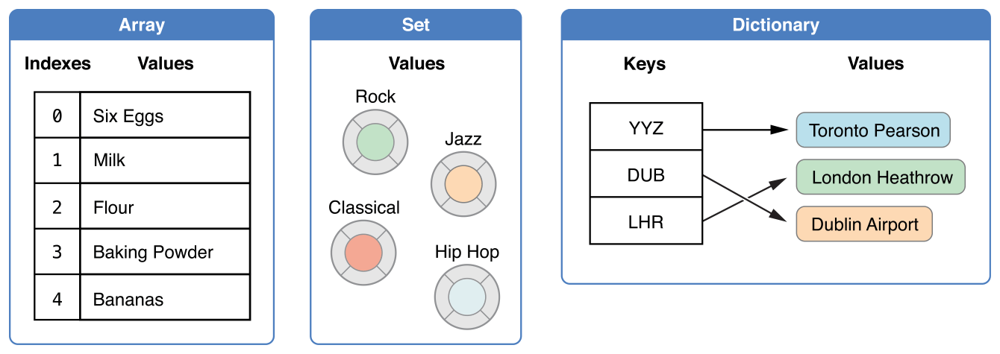
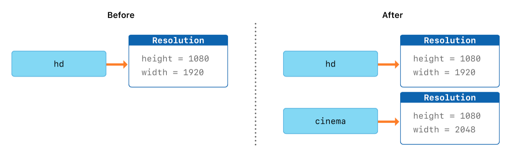
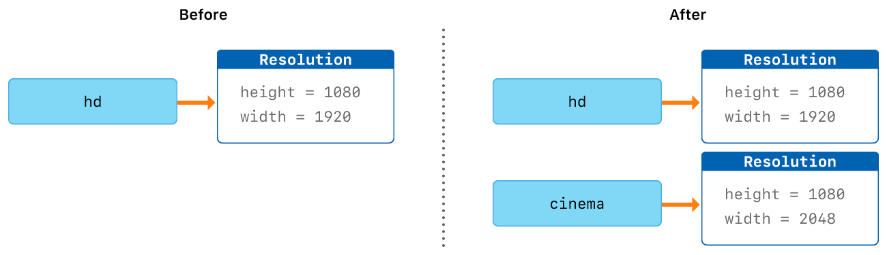
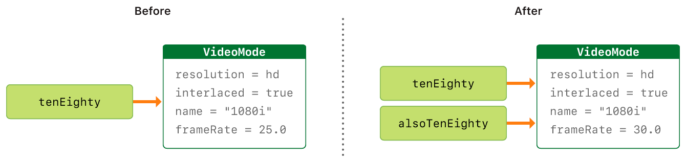
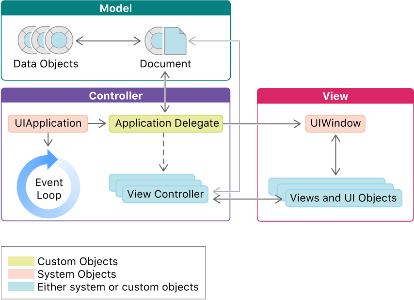

#+TITLE: Swift Introduction
#+SUBTITLE: TNFSH Swift教材 / 顏永進
#+HTML_HEAD: <link rel="stylesheet" type="text/css" href="../css/muse.css" />

# -*- org-export-babel-evaluate: nil -*-
#+latex:\newpage
#+begin_export html

#+end_export

* The Basics
:PROPERTIES:
:CUSTOM_ID: basic
:END:
Swift 是 2014 年由蘋果公司在其開發者大會 WWDC 上所發佈的程式語言

The Swift Programming Language 一書中提到[fn:1]：
1. Swift 用來撰寫 iOS 及 Mac OSX 的程式。
2. Swift 吸收了 C 和 Objective-C 的優點，使其在設計更具彈性、容易，且撰寫時有更多樂趣。
3. Swift 是基於成熟而且倍受喜愛的 Cocoa 和 Cocoa Touch framework，意即 Swift 可以直接使用這些現有的框架
4. Swift 兼具編譯語言的性能，以及直譯式語言的特性。

* Learning Resources
:PROPERTIES:
:CUSTOM_ID: resources
:END:
** Web sites
- [[https://swiftdoc.org/][swiftdoc.org]]
- Swift 官方線上學習手冊: [[https://docs.swift.org/swift-book/LanguageGuide/TheBasics.html][The Swift Programming Language]]
- [[https://www.cnswift.org/the-basics][Swift 编程语言]]
- [[https://www.hackingwithswift.com/quick-start/swiftui][SwiftUI by Example]]
- [[https://www.hackingwithswift.com/100/swiftui][https://www.hackingwithswift.com/100/swiftui]]
- [[http://swiftdeveloperblog.com/code-examples/][Swift Developer Blog]]
- [[https://gradyzhuo.gitbooks.io/meetswifttutorial/content/Episode_1/Chapter_1.html][第一章 - Class, Struct and Enum 的抉擇]]
- [[https://www.hackingwithswift.com/quick-start/swiftui][Hacking with SWIFT]]
- [[https://github.com/search?q=language%3Aswift&ref=cmdform][Github#swift]]
- [[https://stackoverflow.com/questions/tagged/swift][Stack Overflow#swift]]

** Videos
- [[https://www.youtube.com/watch?v=Ulp1Kimblg0][Swift Programming Tutorial for Beginners (Full Tutorial)]]
- [[https://www.raywenderlich.com/ios][iOS & Swift Videos]]

* Swift 常數與變數
:PROPERTIES:
:CUSTOM_ID: variable
:END:
** 宣告常數和變數
常數和變數必須在使用前宣告，用 let 來宣告常數，用 var 來宣告變數。下面的範例展示了如何用常數和變數來記錄使用者嘗試登錄的次數：
#+begin_src swift -r -n :results output :exports both
let maximumNumberOfLoginAttempts = 10
var currentLoginAttempt = 0
#+end_src
你可以在一行中宣告多個常數或者多個變數，用逗號隔開：
#+begin_src swift -r -n :results output :exports both
var x = 0.0, y = 0.0, z = 0.0
var population = 8_000_000
x = 3
y = 4
#+end_src

** Swift v.s. C/C++
Swift 的變數宣告與 C/C++的差異之一在於宣告時不必要先宣告變數型別，例如，同樣要宣告一小數變數與整數變數，C++的做法為
#+begin_src cpp -r -n :results output :exports both
int x = 20;
double pi = 3.1416;
#+end_src
而 Swift 的寫法為：
#+begin_src swift -r -n :results output :exports both
var x = 20
var pi = 3.1416
#+end_src

** Swift is a type-safe language
We declared the variable /numOfStudent/ and assigned 42 (第[[(safeType)]]行) as its initial value, Swift will assigned it the type integer. We can't change its type: it will always be an integer.
#+begin_src swift -r -n
var numOfStudent = 42 (ref:safeType)
numOfStudent = 30
numOfStudent = 25.8
numOfStudent = "fourty" // wrong
#+end_src

#+RESULTS:
#+BEGIN_EXAMPLE
: <stdin>:3:16: error: cannot assign value of type 'Double' to type 'Int'
: numOfStudent = 25.8
:                ^~~~
:                Int()
#+END_EXAMPLE

** 常數與變數的命名
我們可以使用喜歡的字元作為常數和變數名，包括 Unicode 字元：
#+begin_src swift -r -n :results output :exports both :eval no
let π = 3.14159
let 你好 = "你好世界"
let 🐶🐮 = "dogcow"
π = 3.14 // try to change the value of constant and find out what happen
#+end_src
但 Swift 的變數亦有其限制，包括：常數與變數名不能包含數學符號、箭頭、保留的（或者非法的）Unicode 碼位、連線與制表字元（box-drawing characters），也不能以數字開頭，但是可以在常數與變數名的其他地方包含數字。

** 變數與常數的輸出
#+begin_src swift -r -n :results output :exports both
var x = 20
var pi = 3.1416
print(x)
print(pi)
#+end_src

#+RESULTS:
: 20
: 3.1416

** 變數與常數的基本規範
- 使用前需先宣告
- 不能重複宣告
#+begin_src swift -r -n :eval no
var x = 30
let y = 10
// invalid redeclaration of variable
var x = 40
let y = 5
#+end_src

** Stored variable v.s. Computed variable
*** computed variable
#+begin_src swift -r -n :results output :exports both
var x: Double = 4.3
var y: Double = 3.4
var z: Double {
    return x*y
}
print(z)
x = 10
y = 10
print(z) //自動重新計算z值
#+end_src

#+RESULTS:
: 14.62
: 100.0

*** contentView 裡的 body 就是 computed variable
#+begin_src swift -r -n :eval no
var body: som View {
    return Text("Hello world")
}
#+end_src

** 可用來延伸事件(value change)影響範圍的方式
*** didSet

#+begin_src swift -r -n :results output :exports nil
var source = 1
var associated = 2 {
    didSet {
        source = associated
    }
}
print("source: \(source), associaed: \(associated)")
associated = 3
print("source: \(source), associaed: \(associated)")
#+end_src

#+RESULTS:
: source: 1, associaed: 2
: source: 3, associaed: 3

*** closure
#+begin_src swift -r -n :results output :exports nil
func add(left: Int, right: Int, onComplete:(Int)->Void) {
    let result = left + right
    onComplete(result)
}

add(left: 1, right: 2) { returnValue in
    print(returnValue)
}
#+end_src

#+RESULTS:
: 3

* 基本運算
:PROPERTIES:
:CUSTOM_ID: operation
:END:
** 指派運算子
指派運算（a = b），表示用 b 的值來初始化或更新 a 的值：
#+begin_src swift -r -n :results output :exports both
let b = 10
var a = 5
a = b
// a 現在等於 10

let decimalInteger = 17
let binaryInteger = 0b10001       // 17 in binary notation
let octalInteger = 0o21           // 17 in octal notation
let hexadecimalInteger = 0x11     // 17 in hexadecimal notation
#+end_src

** 數值運算子
*** Swift 支援所有數值型別基本運算：
- 加法(+)
- 減法(-)
- 乘法(*)
- 除法(/)
- 餘數(%)
#+begin_src swift -r -n :results output :exports both
print(1 + 2)       // 等於 3
print(5 - 3)       // 等於 2
print(2 * 3)       // 等於 6
print(10.0 / 2.5)  // 等於 4.0
print(10 / 3)      // 等於 1
print(10 & 3)      // 等於 1
#+end_src

#+RESULTS:
: 3
: 2
: 6
: 4.0
: 3
: 32.0

*** 不同數值的運算
#+begin_src swift -r -n :results output : exports both
var r = 10
var pi = 3.14
//print(r*r*pi)  // Try this Error
print(Double(r)*Double(r)*pi)
#+end_src

#+RESULTS:
: 314.0

*** 加法運算子也用於 String 的拼接：
#+begin_src swift -r -n :results output :exports both
"hello, " + "world"  // 等於 "hello, world"
#+end_src

** 複合指派運算子（Compound Assignment Operators）
#+begin_src swift -r -n :results output :exports both
var a = 1
a += 2 // a 現在是 3 (ref:+=)
#+end_src
上述程式第[[(+=)]]行中的 a += 2 為 a = a + 2 的另一種寫法，其他運算子如-、*、/、%皆可套用同樣的簡寫方式。

** 邏輯運算子
邏輯運算的操作物件是邏輯布林值。Swift 支援基於 C 語言的三個標準邏輯運算。
- 邏輯非（!a）
- 邏輯且（a && b）
- 邏輯或（a || b）

* Property Observers
:PROPERTIES:
:CUSTOM_ID: observer
:END:
** Set/Get
在以往的經驗中，對變數進行 assign 是一件直覺而簡單的事，例如：
#+begin_src swift -r -n :results output :exports both
var x: Int = 4
var y: Int = 5
var z: Int

z = x + y
print(z)
#+end_src

#+RESULTS:
: 9

類似 C#，在 Swift 中，我們卻能透過 Set/Get 來介入 assign 的過程，例如：
#+begin_src swift -r -n :results output :exports nil
var x: Int = 4
var y: Int = 5
var z: Int {
    get { return x + y }
    set { y = newValue - x } (ref:set)
}

print(z)
z = 30
print("x新值: \(x), y新值: \(y)")
#+end_src

#+RESULTS:
: 9
: x 新值: 4, y 新值: 26

如上例中，我們可以夾帶一些程式碼，在有人賦予 z 新值時(z=?)利用 set(第[[(set)]]行)觸發這些程式碼；同理，也可以在有人讀取其值時觸發。而 newValue 代表被 assign 的新值。

又如下例，某學生的期中考三科成績就可以在輸入成績後自行判斷各科是否及格
#+begin_src swift -r -n :results output :exports nil
class MidExam {
    var id: String = ""
    var chPass = false
    var ch: Int = 0 {
        didSet { (ref:didset1)
            if ch >= 60 {chPass = true}
        }
    }
    var maPass = false
    var ma: Int = 0 {
        didSet { (ref:didset2)
            if ma >= 60 {maPass = true}
        }
    }
}

let stsc = MidExam()
stsc.id = "202010101"
stsc.ch = 70
stsc.ma = 32

print(stsc.chPass)
print(stsc.maPass)
#+end_src

#+RESULTS:
: true
: false

上述程式第[[(didset1)]]及[[(didset2)]]行中的 didSet 會在變數被 assign 新值時觸發執行，而 willSet 則是在變數即將被 assign 時觸發。

** willSet/set/didSet
- 使用 set 時，因為變數的值正在被改變，所以有 newValue 來儲存新值；
- 使用 willSet 則變數尚未被改變；
- 使用 didSet 則是變數已被改變，所以有 oldValue
根據 apple 的說法，willSet 和 didSet 不會在 init 中被呼叫：The willSet and didSet observers of superclass properties are called when a property is set in a subclass initializer, after the superclass initializer has been called. They are not called while a class is setting its own properties, before the superclass initializer has been called.[fn:2]

* 控制流程
:PROPERTIES:
:CUSTOM_ID: flow-control
:END:
** Conditional Statement
The following examples were from [[https://docs.swift.org/swift-book/LanguageGuide/ControlFlow.html#][docs.swift.org.]]
*** if
In its simplest form, the if statement has a single if condition. It executes a set of statements only if that condition is true.
**** single condition
#+begin_src swift -r -n :eval no
var temperatureInFahrenheit = 30
if temperatureInFahrenheit <= 32 {
    print("It's very cold. Consider wearing a scarf.")
}
#+end_src

**** combined conditions
#+begin_src swift -r -n :eval no
var mathScore = 91
if mathScore <= 100 && mathScore >= 90 {
    print("Grade A")
}
#+end_src

*** if-else
The if statement can provide an alternative set of statements, known as an else clause, for situations when the if condition is false.
#+begin_src swift -r -n :eval no
temperatureInFahrenheit = 40
if temperatureInFahrenheit <= 32 {
    print("It's very cold. Consider wearing a scarf.")
} else {
    print("It's not that cold. Wear a t-shirt.")
}
#+end_src

*** if-else if
You can chain multiple if statements together to consider additional clauses.
#+begin_src swift -r -n :eval no
temperatureInFahrenheit = 90
if temperatureInFahrenheit <= 32 {
    print("It's very cold. Consider wearing a scarf.")
} else if temperatureInFahrenheit >= 86 {
    print("It's really warm. Don't forget to wear sunscreen.")
} else {
    print("It's not that cold. Wear a t-shirt.")
}
#+end_src

*** switch
In its simplest form, a switch statement compares a value against one or more values of the same type.
#+begin_src swift -r -n :eval no
switch some value to consider {
case value 1:
    respond to value 1
case value 2,
     value 3:
    respond to value 2 or 3
default:
    otherwise, do something else
}
#+end_src
This example uses a switch statement to consider a single lowercase character called someCharacter:
#+begin_src swift -r -n :eval no
let someCharacter: Character = "z"
switch someCharacter {
case "a":
    print("The first letter of the alphabet")
case "z":
    print("The last letter of the alphabet")
default:
    print("Some other character")
}
#+end_src
#+begin_src swift -r -n :eval no
// 把分數轉成等第
// A(90-100), B(80-90), C(70-80), D(60-70), E(60-)
import Foundation

let str = readLine()    //從鍵盤讀入一字串, 存到str中
let choice = Int(str!)   //把str轉成整數，存入score

switch choice! {
case 90..<101:
    print("A")
case 80..<90:
    print("B")
case 70..<80:
    print("C")
default:
    print("E")
}

#+end_src

** For-In Loops
*** 語法
#+begin_src swift -r -n :eval no
for counter in lower...upper{
    your codes
}
#+end_src
*** DEMO
#+begin_src swift -r -n :results output :exports both
for index in 1...5 {
    print("\(index) times 5 is \(index * 5)")
}
#+end_src

#+RESULTS:
: 1 times 5 is 5
: 2 times 5 is 10
: 3 times 5 is 15
: 4 times 5 is 20
: 5 times 5 is 25

#+begin_src swift -r -n :results output :exports both
let base = 3
let power = 10
var answer = 1
for _ in 1...power {
    answer *= base
}
print("\(base) to the power of \(power) is \(answer)")
#+end_src

#+RESULTS:
: 3 to the power of 10 is 59049

** While Loops
A while loop performs a set of statements until a condition becomes false. These kinds of loops are best used when the number of iterations is not known before the first iteration begins. Swift provides two kinds of while loops:

- while evaluates its condition at the start of each pass through the loop.
- repeat-while evaluates its condition at the end of each pass through the loop.

*** while
A while loop starts by evaluating a single condition. If the condition is true, a set of statements is repeated until the condition becomes false.

**** 語法
#+begin_src swift -r -n :eval no
while condition {
    your codes here
}
#+end_src

**** DEMO
#+begin_src swift -r -n :results output :exports both
var counter = 5
while counter > 0 {
    print("Hello, \(counter)")
    counter -= 1
}
#+end_src

#+RESULTS:
: Hello, 5
: Hello, 4
: Hello, 3
: Hello, 2
: Hello, 1

*** repeat ... while
The other variation of the while loop, known as the repeat-while loop, performs a single pass through the loop block first, before considering the loop’s condition. It then continues to repeat the loop until the condition is false.

**** 語法
#+begin_src swift -r -n :eval no
repeat {
    your codes here
} while condition
#+end_src

**** DEMO
#+begin_src swift -r -n :results output :exports both
var counter = 5
repeat {
    print("Hello, \(counter)")
    counter -= 1
} while counter > 0
#+end_src

#+RESULTS:
: Hello, 5
: Hello, 4
: Hello, 3
: Hello, 2
: Hello, 1

* 集合型別
:PROPERTIES:
:CUSTOM_ID: set
:END:
Swift provides three primary collection types, known as arrays, sets, and dictionaries, for storing collections of values. Arrays are ordered collections of values. Sets are unordered collections of unique values. Dictionaries are unordered collections of key-value associations.[fn:3]
#+CAPTION: Collection Types of Swift
#+LABEL:fig:cts
#+name: fig:cts
#+ATTR_LATEX: :width 400
#+ATTR_ORG: :width 400
#+ATTR_HTML: :width 400

** 陣列（Arrays）
陣列使用有序列表儲存同一型別的多個值。相同的值可以多次出現在一個陣列的不同位置中。
*** 陣列建構語法
要建立一個空的整數陣列：
#+begin_src swift -r -n :results output :exports both
var EnglishScores = [Int]()
print(EnglishScores)
// OR
var NameArray = [String]()
#+end_src

#+RESULTS:
: []

下面這個範例創建了一個叫做 shoppingList 並且儲存字串的陣列：
#+begin_src swift -r -n :results output :exports both
var shoppingList: [String] = ["Eggs", "Milk"]
// shoppingList 已經被建構並且擁有兩個初始項。
#+end_src

#+RESULTS:

*** 存取和修改陣列
我們可以通過陣列的方法和屬性來存取和修改陣列，或者下標語法。 還可以
- 使用陣列的唯讀屬性 count 來獲取陣列中的資料項數量
- 使用布林項 isEmpty 來作為檢查 count 屬性的值是否為 0
- 使用 append 方法在陣列後面添加新的資料項
- +=
- remove(at: index)
#+begin_src swift -r -n :results output :exports both
var shoppingList: [String]  = ["Eggs", "Milk"]
print(shoppingList.count)
print(shoppingList.isEmpty)
shoppingList += ["Bird"]  // Not += "Bird"
shoppingList.append("Fish")
print(shoppingList)
print(shoppingList[0])
shoppingList += ["Beer"]
print(shoppingList)
shoppingList.remove(at: 1)
print(shoppingList)
#+end_src

#+RESULTS:
: 2
: false
: ["Eggs", "Milk", "Bird", "Fish"]
: Eggs
: ["Eggs", "Milk", "Bird", "Fish", "Beer"]
: ["Eggs", "Bird", "Fish", "Beer"]

*** 以 for 遍歷陣列
#+begin_src swift -r -n :results output :exports both
var shoppingList: [String]  = ["Eggs", "Milk", "Beer"]
for index in 0...2 {
    print(shoppingList[index])
}
for item in shoppingList {
    print(item)
}
#+end_src

#+RESULTS:
: Eggs
: Milk
: Beer
: Eggs
: Milk
: Beer

*** 以 repeat 產生 array
If you need to create an array of a specific size holding some default values, Swift has a built-in initializer called repeating:count:. You tell it what to repeat, and how often, and Swift will generate an array of that size.[fn:4]
#+begin_src swift -r -n :results output :exports nil
let nums1 = [Int](repeating: 0, count: 10)
let str1 = [String](repeating: "TNFSH", count: 5)
print(nums1)
print(str1)

let nums2 = [[Int]](repeating: [Int](repeating: 6, count: 3), count: 2)
print(nums2)
#+end_src

#+RESULTS:
: [0, 0, 0, 0, 0, 0, 0, 0, 0, 0]
: ["TNFSH", "TNFSH", "TNFSH", "TNFSH", "TNFSH"]
: [[6, 6, 6], [6, 6, 6]]

*** Modify array
**** map: 批次 update array
通常我們會使用到 map 函數的原因，主要是要將陣列的內容進行批次變更[fn:5]，如：
  #+begin_src swift -r -n :results output :exports nil
let origin = ["James", "Vanessa", "Ruby", "Letranger"]
let lowercaseVersion = origin.map { $0.lowercased() }
print(lowercaseVersion)

let letterCounts = origin.map { $0.count }
print(letterCounts)

let nums = [0, 1, 2, 3, 4, 5]
let doubleNums = nums.map { (number) -> Int in
    number * 2
}
print(doubleNums)

let doubleStrings = nums.map { (number) -> String in
    "2 * \(number) = \(number * 2)"
}
print(doubleStrings)
  #+end_src

  #+RESULTS:
  : ["james", "vanessa", "ruby", "letranger"]
  : [5, 7, 4, 9]
  : [0, 2, 4, 6, 8, 10]
  : ["2 * 0 = 0", "2 * 1 = 2", "2 * 2 = 4", "2 * 3 = 6", "2 * 4 = 8", "2 * 5 = 10"]

*** flatMap()
flatMap 其實就是 flat + map 的結果。而 flatMap 最常是用來處理攤平某個陣列的狀況[fn:5]
#+begin_src swift -r -n :results output :exports nil
let nums = [2, 3, 4]
let mapped = nums.map { Array(repeating: $0, count: $0) }
print(mapped)

let flatMapped = mapped.flatMap{$0} (ref:flat)
print(flatMapped)

#+end_src

#+RESULTS:
: [[2, 2], [3, 3, 3], [4, 4, 4, 4]]
: [2, 2, 3, 3, 3, 4, 4, 4, 4]

上述程式中第[[(flat)]]行的效果與 Array(nums.map(transform).joined())相同。

*** compactMap
compactMap 所映射出的元素結果都是非可選（non-nil）的值。因此，當你的希望映射結果的陣列是非可選類型的，那麼使用 compactMap 是一個適合的做法[fn:5]。
#+begin_src swift -r -n :results output :exports nil
let possibleNums = ["1", "2", "three", "///4///", "5"]
let mapped = possibleNums.map { str in Int(str) }
print(mapped)

let comMapped = possibleNums.compactMap { str in Int(str) }
print(comMapped)
#+end_src

#+RESULTS:
: [Optional(1), Optional(2), nil, nil, Optional(5)]
: [1, 2, 5]

*** Array of Struct
基本的陣列提供了我們儲存大批資料的機制，然而，上述所示範的簡易型陣列彈性略嫌不足，如果我們想要開發一個圖書相關的 app，一開始我們至少需要這樣的陣列：
#+begin_src swift -r -n :results output :exports nil
let book = ["X的悲劇", "地獄藍調","東方列車謀殺案","八百萬種死法","血字研究"]
#+end_src
然而，書本至少還要有作者吧，於是，我們可能又會加入作者的陣列:
#+begin_src swift -r -n :results output :exports nil
let book = ["X的悲劇", "地獄藍調","東方列車謀殺案","八百萬種死法","血字研究"]
let author = ["艾勒里．昆恩", "李查德", "阿嘉莎‧克莉絲蒂","勞倫斯.卜洛克","柯南道爾"]
#+end_src
這種設計方式雖然可行，但是卻有幾個問題：
1. 書名與作者存在不同陣列中，而且書名與作者並無直接的連結
2. 當我們要再加入出版年份、出版社、售價...等資訊時，就會發現需要太多的陣列了

Struct 就是一種十分適合用來儲存相關資料的型別，以上述書籍資料為例，我們可以先建立一個這樣的 Struct:
#+begin_src swift -r -n :results output :exports nil
struct Book {
    var title: String
    var author: String
}
#+end_src
接下來，再建立一個上述 struct 的陣列，如此一來，不管書籍資料再如何複雜，我們都可以一個陣列來儲存：
#+begin_src swift -r -n :results output :exports nil
struct Book {
    var title: String
    var author: String
}
var books = [
    Book(title:"X的悲劇", author: "艾勒里．昆恩"),
    Book(title:"地獄藍調", author: "李查德"),
    Book(title:"東方列車謀殺案", author: "阿嘉莎‧克莉絲蒂"),
    Book(title:"八百萬種死法", author: "勞倫斯.卜洛克"),
    Book(title:"血字研究", author: "柯南道爾")
]
// 存取陣列中struct的方式
print(books[1].title)
print(books[1].author)
#+end_src

#+RESULTS:
: 地獄藍調
: 李查德

** 集合（Sets）
集合（Set）是 Swift 集合類型（collection types）之一，集合用來存儲類型相同且沒有確定順序唯一的值。

*** 宣告
#+begin_src swift -r -n :results output :exports both
var letrers = Set<Character>()
#+end_src

*** 存取集合
#+begin_src swift -r -n :results output :exports both
var letters = Set<Character>()
print(letters.count)
letters.insert("a")
print(letters.isEmpty)
letters.insert("b")
letters.insert("c")
letters.insert("d")
letters.remove("c")
for item in letters {
    print("\(item)")
}
#+end_src

#+RESULTS:
: 0
: false
: a
: b
: d

*** 交集、聯集
#+begin_src swift -r -n :results output :exports both
let oddDigits: Set = [1, 3, 5, 7, 9]
let evenDigits: Set = [0, 2, 4, 6, 8]
let primeNumbers: Set = [2, 3, 5, 7]

print(oddDigits.union(evenDigits))
print(oddDigits.union(evenDigits).sorted())
print(oddDigits.intersection(evenDigits).sorted())
print(oddDigits.subtracting(primeNumbers).sorted())
print(oddDigits.symmetricDifference(primeNumbers).sorted())
#+end_src

#+RESULTS:
: [4, 7, 6, 1, 2, 3, 5, 8, 9, 0]
: [0, 1, 2, 3, 4, 5, 6, 7, 8, 9]
: []
: [1, 9]
: [1, 2, 9]

*** 學習資源
- [[https://swift.gg/2019/07/09/Sets-in-Swift/][Swift中的集合(Set)]]

** 字典（Dictionaries）
字典是一種儲存多個相同型別的值的容器。每個值（value）都關聯唯一的鍵（key），鍵作為字典中的這個值資料的識別符號。和陣列中的資料項不同，字典中的資料項並沒有具體順序。我們在需要通過識別符號（鍵）存取資料的時候使用字典，這種方法很大程度上和我們在現實世界中使用字典查字義的方法一樣[fn:6]。

*** 建立字典
#+begin_src swift -r -n :results output :exports both
var namesOfIntegers = [Int: String]()
// namesOfIntegers is an empty [Int: String] dictionary
namesOfIntegers[16] = "Sixteen"
print(namesOfIntegers)
#+end_src

#+RESULTS:
: [16: "Sixteen"]

一個字典字面量是一個定義擁有一個或者多個鍵值對的字典集合的簡單語句。一個鍵值對是一個 key 和一個 value 的結合體。在字典字面量中，每一個鍵值對的鍵和值都由冒號分割。這些鍵值對構成一個列表，其中這些鍵值對由方括號包含並且由逗號分割：
#+begin_src swift -r -n :results output :exports both
[key 1: value 1, key 2: value 2, key 3: value 3]
#+end_src

*** 存取字典
#+begin_src swift -r -n :results output :exports both
var autherOfWriting: [String: String] = ["老人與海": "海明威", "異鄉人": "卡謬", "百年孤寂": "馬奎斯", "浪淘沙": "東方白"]
print(autherOfWriting)
print("一共有\(autherOfWriting.count)本書")
print(autherOfWriting.isEmpty)
autherOfWriting["鼠疫"] = "卡謬"
for (writing, author) in autherOfWriting {
    print("\(writing)的作者為\(author)")
}
#+end_src

#+RESULTS:
: ["浪淘沙": "東方白", "百年孤寂": "馬奎斯", "老人與海": "海明威", "異鄉人": "卡謬"]
: 一共有 4 本書
: false
: 浪淘沙的作者為東方白
: 百年孤寂的作者為馬奎斯
: 老人與海的作者為海明威
: 異鄉人的作者為卡謬
: 鼠疫的作者為卡謬

* Functions
:PROPERTIES:
:CUSTOM_ID: function
:END:
Functions are self-contained chunks of code that perform a specific task. You give a function a name that identifies what it does, and this name is used to “call” the function to perform its task when needed.

Swift’s unified function syntax is flexible enough to express anything from a simple C-style function with no parameter names to a complex Objective-C-style method with names and argument labels for each parameter. Parameters can provide default values to simplify function calls and can be passed as in-out parameters, which modify a passed variable once the function has completed its execution.

** Functions 的定義與呼叫
*** 語法
#+begin_src swift -r -n :eval no
func name(arg1 param1: DataTyp, arg2 param2: DataType) -> returnValue DataType {
     your code here
     return returnValue
}
#+end_src

*** DEMO
#+begin_src swift -r -n :results output : exports both
func greet(person: String) -> String {
    let greeting = "Hello, " + person + "!"
    return greeting
}

print(greet(person: "Vanessa"))
print(greet(person: "James"))

#+end_src

#+RESULTS:
: Hello, Vanessa!
: Hello, James!

*** Functions 的參數與傳回值
Function 可以沒有參數，也可以有很多參數，可以沒有傳回值，也可以有很多傳回值(這點與 C/C++不同)
**** 沒有參數
#+begin_src swift -r -n :eval no
func sayHelloWorld() -> String {
    return "hello, world"
}
print(sayHelloWorld())
#+end_src
**** 有很多參數
#+begin_src swift -r -n :eval no
func greet(person: String, alreadyGreeted: Bool) -> String {
    if alreadyGreeted {
        return "Hello, " + person + " again."
    } else {
        return "Hello, " + person
    }
}
print(greet(person: "Tim", alreadyGreeted: true))
// Prints "Hello again, Tim!"
#+end_src

function 的參數可以有兩種名稱：internal name 與 external name，internal 用於 function 內；external name 提供外部程式呼叫 function 使用。若 function 有一個以上的參數，可以省略第一個參數的名稱，如：
#+begin_src swift -r -n :results output
func greet(_ person: String, hiAgain alreadyGreeted: Bool) -> String {
    if alreadyGreeted {
        return "Hello, " + person + " again."
    } else {
        return "Hello, " + person
    }
}
print(greet("Vanessa", hiAgain: true))
print(greet("James", hiAgain: false))
// Prints "Hello again, Tim!"

#+end_src

#+RESULTS:
: Hello, Vanessa again.
: Hello, James
**** 沒有傳回值
#+begin_src swift -r -n :eval no
func greet(person: String) {
    print("Hello, \(person)!")
}
greet(person: "Dave")
#+end_src
**** 有很多傳回值
#+begin_src swift -r -n :results output :exports both
func myDiv(dividend: Int, divisor: Int) -> (quotient: Int, remainder: Int) {
    return (dividend / divisor, dividend % divisor)
}

let results = myDiv(dividend: 10, divisor: 3)
print("商：\(results.quotient)，餘數：\(results.remainder)")
#+end_src

#+RESULTS:
: 商：3，餘數：1

* Generics
:PROPERTIES:
:CUSTOM_ID: generics
:END:
當使用者"不在乎"其資料型別時使用，典型的例子為陣列，陣列可以儲存各式各樣型態的資料：Int, Double, String, Struct...

陣列的定義方式如下
#+begin_src swift -r -n :eval no
strut Array<Element> {
    //....
    func append(_ element: Element) {...} (ref:arap)
}
#+end_src
上述程式第[[(arap)]]行 append 的參數 Element 即為一"don't care"型別，代表<Element>裡可以填上 Int, String, Struct...。其正式名稱為 Type Parameter。

* Types
:PROPERTIES:
:CUSTOM_ID: types
:END:
** Varietities of Types
- struct
- class
- protocol
- "Dont' Care" type (generics)
- enum
- functions

** Functions as Types
如同 Int 或 Double，function 也可以是一種 type，如：
#+begin_src swift -r -n :eval no
var foo: (Double) -> Void
func doSomething(what: () ->)
#+end_src
上述程式中第 1 行的 foo 為一變數，其型別為：輸入一小數變數、不傳回值，第 2 行 function 中的參數 what 的型別為一個沒有輸入、傳回 bool 的變數。

如下例：
#+begin_src swift -r -n :results output
func square(operand: Double) -> Double {
    return operand * operand
}

var operation = square (ref:fat)
let result1 = operation(4)
print(result1)

operation = abs
let result2 = operation(-3)
print(result2)
#+end_src

#+RESULTS:
: 16.0
: 3.0

程式中的第[[(fat)]]行中，令 operation 變數之型別為 square 這個 function，於是 operation 就可以如 function 般進行計算；也可以令 operation 為內建的 function(如 abs)

* Closures
It’s kinda like a function you can assign to a variable.一個能接受參數的變數。
#+begin_src swift -r -n :results output :exports nil
let makeGreeting: (String) -> String = { name in
    return "Hello, \(name)!"
}

let message = makeGreeting("Bob")
print(message)
#+end_src

#+RESULTS:
: Hello, Bob!

上例中常數makeGreeting就包含了一個closure，作用與function一模一樣。
** closure語法與簡化
#+begin_src swift -r -n :results output :exports nil
import Foundation

var simpleClosure: (Int, Int) -> Int (ref:dec1)
simpleClosure = { (a: Int, b: Int) -> Int in (ref:dec2)
    return a + b
}
print(simpleClosure(3, 4))
#+end_src

#+RESULTS:
: 7
因為第[[(dec1)]]行已宣告了參數與return type，故第[[(dec2)]]行也可以改寫成
#+begin_src swift -r -n :results output :exports nil
import Foundation

var simpleClosure: (Int, Int) -> Int (ref:dec1)
simpleClosure = { (a, b) in
    return a + b
}
print(simpleClosure(3, 4))

#+end_src

#+RESULTS:
: 7
也可再簡化為:
#+begin_src swift -r -n :results output :exports nil
import Foundation

var simpleClosure: (Int, Int) -> Int (ref:dec1)
simpleClosure = {
    return $0 + $1
}
print(simpleClosure(3, 4))
#+end_src

#+RESULTS:
: 7
** closure as function parameter
既然closure與function作用一樣，那為什麼不直接用function呢?
原因之一是closure可以拿來當成其他function的參數
#+begin_src swift -r -n :results output :exports nil
import Foundation

// simpleClosure: take two Int paprameters and return one Int
var simpleAddClosure: (Int, Int) -> Int (ref:dec1)
simpleAddClosure = {
    return $0 + $1
}

var simpleMinusClosure: (Int, Int) -> Int
simpleMinusClosure = {
    return $0 - $1
}
func operation(_ a: Int, _ b: Int, op: (Int, Int) -> Int) -> Int {
    return op(a, b)
}

print(operation(2, 3, op: simpleAddClosure))
print(operation(2, 3, op: simpleMinusClosure))
#+end_src

#+RESULTS:
: 5
: -1

** Completion Handler
用closure而不用function的另一個原因是: closureh佷適合拿來當成completion handler。
Since you can move the closure around in your code and call it at a later point. This make closures exceptionally useful as useful as /completion handlers/, i.e. the code you call when a long-running task has finished.

A common application of a closure is the completion handler. It works roughly like this:[fn:7]
- You’re executing a lengthy task in your code, like downloading a file, making a calculation, or waiting for a webservice request
- You want to execute some code when the lengthy task is completed, but you don’t want to “poll” the task continuously to check if it’s finished
- Instead, you provide closure to the lengthy task, which it will call when the task is completed

假設有一個輸出closure block，該closure傳入一整數，輸出結果
#+begin_src swift -r -n :results output :exports nil
let block: (Int) -> Void = { total in
   print("Sum of the first 1000 number is \(total)")
}
block(20)
#+end_src

#+RESULTS:
: Sum of the first 1000 number is 20

現在另外設計一個\( \sum^{1000}_{n=1}{n} \)的function，等加總計算完畢後，就緊接著執行這個block將結果輸出:
#+begin_src swift -r -n :results output :exports nil
let block: (Int) -> Void = { total in
   print("Sum of the first 1000 number is \(total)")
}

func sumOfFirstThousandNumber(completionHandler: (Int) -> Void) {
    var total = 0
    for i in 1...1000 {
        total = total + i
    }

    completionHandler(total)
}

sumOfFirstThousandNumber(completionHandler: block)
#+end_src

#+RESULTS:
: Sum of the first 1000 number is 500500

From Swift 3.x, closure parameters are @nonescaping by default, It means closure will also be executed with the function body if you wanna escape closure execution mark it as @escaping.

Completion handler另一個常見的例子是檔案下載，假設我們要自web下載一個image並將之顯示在View中，程式碼大致如下：
#+begin_src swift -r -n :results output :exports nil :eval no
let task = URLSession.shared.dataTask(with: URL(string: "http://example.com/cats.jpg")!, completionHandler: { data, response, error in
    // Do something with image

})
#+end_src
上例中，先以URLSession對網站提出HTTP request下載cats.jpg，closure *completionHandler* 為 *dataTask()* 函數的參數，會在cats.jpg被下載後執行，這就是所謂的 /completion handler/ 。

** @nonescaping closures:
#+BEGIN_COMMENT
When passing a closure as the function argument, the closure gets execute with the function’s body and returns the closure back. As the execution ends, the passed closure goes out of scope and have no more existence in memory.
#+END_COMMENT
參考以下範例:
#+begin_src swift -r -n :results output :exports nil
class ClosureTesting {
    func getUser(completion: (String)->Void) {
        completion("TNFSH")
    }
    func execute() {
        getUser { user in
            print(user)
        }
    }
}

let test = ClosureTesting()
test.execute()
#+end_src

#+RESULTS:
: TNFSH

Class ClosureTesting有一function getUser, getUser會接受一個傳入參數completion，該參數為一closure，接受一個傳入參數(字串)，傳回Void，並在geUser中執行所傳入的closure。

Class還有一function execute，該function呼叫getUser，所以要傳入一個closure參數，這個closure接受一個參數並將之輸出。

以上即為non-escaping closure，因為function getuser在execute()執行後就return了。如果getUser裡的closure(completion)執行很久呢?能不能讓一段程式碼在function return後執行?

*** Multi-Threading
一種方式是利用concurrent queue讓closure在不同thread執行:
#+begin_src swift -r -n :results output :exports nil :eval no
import Foundation

class ClosureTesting {
    let queue = DispatchQueue(label: "concurrentQueue", attributes: .concurrent)
    func getUser(completion: (String)->Void) {
        queue.async {
            // let sepnd some time to fetch the data
            Thread.sleep(forTimeInterval: Double.random(in: 0...2))
            completion("TNFSH")
        }
    }
    func execute() {
        getUser { user in
            print(user)
        }
    }
}
let test = ClosureTesting()
test.execute()
#+end_src
這段程式碼中，getUser裡的closure被設定為非同步執行，如此一來，這個function會在closure執行前就return了，這是十分常見的網路行為，例如closure正在下載資料，然而這段程式碼會導致如下錯誤:
#+RESULTS:
: <stdin>:6:21: error: escaping closure captures non-escaping parameter 'completion'
:         queue.async {
:                     ^
: <stdin>:5:18: note: parameter 'completion' is implicitly non-escaping
:     func getUser(completion: (String)->Void) {
:                  ^
: <stdin>:9:13: note: captured here
:             completion("TNFSH")
:             ^
Swift官方文件解釋:
#+begin_verse
“When you declare a function that takes a closure as one of its parameters, you can write @escaping before the parameter’s type to indicate that the closure is allowed to escape.”
#+end_verse
即，為了讓closure能合法「逃脫」，closure必須在前面冠上 *@escaping 。如下:

#+begin_src swift -r -n :results output :exports nil :eval no
import Foundation

class ClosureTesting {
    let queue = DispatchQueue(label: "concurrentQueue", attributes: .concurrent)
    func getUser(completion: @escaping (String)->Void) {
        queue.async {
            // let sepnd some time to fetch the data
            Thread.sleep(forTimeInterval: Double.random(in: 0...2))
            completion("TNFSH")
        }
    }
    func execute() {
        getUser { user in
            print(user)
        }
    }
}
let test = ClosureTesting()
test.execute()

#+end_src

#+RESULTS:
: TNFSH

再看看以下的例子，function sortArray接受一個整數陣列參數、並設置一個handler:一個傳入Int傳回Void的closure,function將傳入的陣列進行排序，然後執行handler。
doSomething呼叫sortArray後，傳入一組整數陣列，希望做到的handler是將排序後的Array輸出。
#+begin_src swift -r -n :results output :exports nil
func sortArray(array:[Int], handler: (([Int])->Void)) {
    // step 2
    var sortedArray: [Int] = []
    sortedArray = array.sorted();
    // step 3
    handler(sortedArray) (ref:return)
}
func doSomething() {
    // setp 1
    sortArray(array: [50,333,434,2,8,3,54,73,99,83,13]) {(result) in
        // step 4
        print("Sorted Array: \(result)")
    }
}
doSomething()
#+end_src

#+RESULTS:
: Sorted Array: [2, 3, 8, 13, 50, 54, 73, 83, 99, 333, 434]

** @escaping closure:
在前例中，如果我們在function sortArray return後仍需取用array的內容，則就需要將之設為@escaping closure。
即，我們希望在第[[(return)]]行後取得已排序的值進行其他應用，則要將之設定為@escaping closure
#+begin_src swift -r -n :results output :exports nil
var findMaxFromArray: (([Int])-> Void)?

func findMaxNumber(array:[Int], handler: @escaping ([Int])->Void) {
    //step 2
    handler(array)
    //setp 3
    findMaxFromArray = handler
}
func doSomething() {
    //setp 1
    findMaxNumber(array: [11,52,33,34,5,65,7,8,29,10]) {(result) in
        let maxNumber = result.max()!

        //step 4
        print("Max number from Array: \(maxNumber)")
    }
}
doSomething()
//setp 5
findMaxFromArray!([100,300,754,222,44,432,535])
#+end_src

#+RESULTS:
: Max number from Array: 65
: Max number from Array: 754

A Closure is said to *escape* a function when the closure is passed as an argument to the function, but is called after the function returns.

再看另一個@escaping例子
#+begin_src swift -r -n :results output :exports nil
func dataTask(with url: URL,
completionHandler: @escaping (Data?, URLResponse?, Error?) -> Void) -> URLSessionDataTask
#+end_src
function dataTask有兩個參數: 網址資源url以及closure completionHandler，而closure completionHandler有三個參數：
- data?: 即所下載的資料本身，如圖片
- URLResponse?: 包含網路回應資訊的object
- Error?: 包含錯誤訊息的object，也有可能是一個nil

function參數中的 *@escaping* 意謂著做為參數傳入dataTask function的closure被允許逃離dataTask，換句話說， *這個closure會在function dataTask結束執行後才被呼叫* 。

如果把escaping closure看成一段在function外部的程式碼大概會比較容易理解這個邏輯，function為監獄，而closure為犯人。典型的例子就是completion handler，這個handler在他的建立環境(fuction)消失之後仍然強悍地生存下來並執行任務。

** escaping v.s. non-escaping closure
- An *escaping closure* is a closure that's called /after/ the function it was passed to returns. In other words, it /outlives/ the function it was passwd to.
- A *non-escaping closure* is a closure that's called /within/ the function it was passed into, i.e., /before/ it returns. This closure never passes the bounds of the function it was passed into.
再看兩個較簡單的例子
*** @noescaping
#+begin_src swift -r -n :results output :exports nil
func doSomething(callback:()->Void) {
    callback()
}
let onComplete:()->Void = { debugPrint("executed") }
doSomething(callback: onComplete) // executed

#+end_src

#+RESULTS:
: "executed"
*** @escaping
#+begin_src swift -r -n :results output :exports nil
class SomeClass {
    var callback:(()->Void)?
    func doSomething(callback:@escaping ()->Void) {
        self.callback = callback  // error: 閉包逃離該函式
    }
}

let onComplete:()->Void = { debugPrint("executed") }

let someObj = SomeClass()
someObj.doSomething(callback : onComplete)
#+end_src

#+RESULTS:

同理，如果閉包被放進async dispatch queue，則該閉包也會被queue retain，同樣可能在函式結束後才被執行，因此也算是「逃離」。

*** @noescape有什麼限制
- 不能在函式外儲存
- 不能進async dispatch queue
- 不能丟進其他non-@noescape參數

** 進階概念
- [[https://learnappmaking.com/escaping-closures-swift/][Escaping Closures in Swift Explained ]]
- [[https://www.jianshu.com/p/9fb444e88d26][Swift @noescape與@escaping]]

* Struct, Class, and Enum
:PROPERTIES:
:CUSTOM_ID: SW-Struct-Class-Enum
:END:
#+begin_verse
struct, class, and enum are fundamentally important concepts for every iOS developer. It’s difficult to imagine common iOS apps without them. [fn:8]
#+end_verse

Class 和 Struct 是一種多功能且靈活的構造體，作為程式碼中的構造基礎。你可以使用與常數，變數和函數完全相同的語法來定義屬性和方法，以便為 Class 和 Struct 增加功能[fn:9]。

| strudt                                    | class                                   |
| Value type                                | Reference type                          |
| Copied when passed or assigned            | Passed around via pointers              |
| Copy on write                             | Automatically reference counted         |
| Functional programming                    | Object-oriented programming             |
| No inheritance                            | Inheritance (single)                    |
| "Free" init initalizes ALL vars           | "Free" init initializes NO vars         |
| Mutability must be explicitly stated      | Always mutable                          |
| Your "go to" data structure               | Used in specific circumstances          |
| Everything you've seen so far is a struct | The ViewModel in MVVM is always a class |
|                                           |                                         |

- 大多變數均為 struct(除了 View 之外)，如 arrays, dictionaries, Ints, Bools, Doubles,
- functional programming: foucs 在資料的 functionality
- object-oriented programming: focus 在將資料與其 functionality 封裝(encapsulate)入某個 object
- single inheritance: 只能繼承自一個 class
- 支援 multiple inheritance 的語言：C++, Common Lisp, Perl, Python, R, Raku, Tcl[fn:10].

** 語法
#+begin_src swift -r -n :eval no
struct SomeStructure {
    // structure definition goes here
}
class SomeClass {
    // class definition goes here
}
#+end_src

** DEMO
*** 宣告
#+begin_src swift -r -n :eval no
struct Resolution {
    var width = 0
    var height = 0
}
class VideoMode {
    var resolution = Resolution()
    var interlaced = false
    var frameRate = 0.0
    var name: String?
}

#+end_src

*** Init
用於建立 stuct 或 class，為內部變數進行初始化。
#+begin_src swift -r -n :eval no
struct DiceGme {
    init(numberOfDices: Int){
        // create a dice with that many dices
    }
}
#+end_src

*** Structure and Class Instances
The Resolution structure definition and the VideoMode class definition only describe what a Resolution or VideoMode will look like. They themselves don’t describe a specific resolution or video mode. To do that, you need to create an instance of the structure or class.

#+begin_src swift -r -n :eval no
let someResolution = Resolution()
let someVideoMode = VideoMode()
#+end_src

*** Accessing Properties
You can access the properties of an instance using dot syntax. In dot syntax, you write the property name immediately after the instance name, separated by a period (.), without any spaces:

#+begin_src swift -r -n :eval no
print("The width of someResolution is \(someResolution.width)")
// Prints "The width of someResolution is 0"
print("The width of someVideoMode is \(someVideoMode.resolution.width)")
// Prints "The width of someVideoMode is 0"
#+end_src

You can also use dot syntax to assign a new value to a variable property:
#+begin_src swift -r -n :eval no
someVideoMode.resolution.width = 1280
print("The width of someVideoMode is now \(someVideoMode.resolution.width)")
// Prints "The width of someVideoMode is now 1280"
#+end_src

** Struct
*** stored properties和computed properties
#+begin_src swift -r -n :results output :exports nil
struct Person {
    let firstName: String
    let lastName: String
}

struct Employee {
    let identity: Person
    var jobTitle: String
    var salary: Double
}

let me = Person(firstName: "Letranger", lastName: "Yen")
var letranger = Employee(identity: me, jobTitle: "CEO", salary: 3000)

print(me.firstName)
print(letranger.identity)
print(letranger.jobTitle)
#+end_src

#+RESULTS:
: Letranger
: Person(firstName: "Letranger", lastName: "Yen")
: CEO

Person與Employee下的firstName, lastName, jobTitle都為stored property,也都存了值，會佔用memory，另竹種properties為計算所得，稱computed properties。
#+begin_src swift -r -n :results output :exports nil
struct Person {
    let firstName: String
    let lastName: String
}

struct Employee {
    let identity: Person
    var jobTitle: String
    var salary: Double

    var tax: Double {
        return salary * 0.05
    }
}

let me = Person(firstName: "Letranger", lastName: "Yen")
var letranger = Employee(identity: me, jobTitle: "CEO", salary: 3000)

print(letranger.tax)
#+end_src

#+RESULTS:
: 150.0
*** type properties
computed property和stored property都是instance的属性，数据类型也有自己的属性，这就是type property。例如：
#+begin_src swift -r -n :results output :exports nil
struct Person {
    let firstName: String
    let lastName: String
}
struct Employee {
  static var location = "高雄"
  let identity: Person
  var jobTitle: String
  var salary: Double
}
print(Employee.location)
#+end_src

#+RESULTS:
: 高雄

location前面加了static，这就意味着location是Employee这个类型的属性，不用创建instance就可以读取。在实践中有时候会很有用。
*** property observers
store property是有observer观察者的，willSet会在属性即将更新的时候执行；didSet会在属性刚更新完的时候执行。
#+begin_src swift -r -n :results output :exports nil
struct Person {
    let firstName: String
    let lastName: String
}

struct Employee {
    let identity: Person
    static var location = "高雄"
    var jobTitle: String
    var salary: Double {
        didSet {
            if salary >= oldValue * 2 {
                Employee.location = "國外"
            }
        }
    }

    var tax: Double {
        return salary * 0.05
    }
}

let me = Person(firstName: "Letranger", lastName: "Yen")
var letranger = Employee(identity: me, jobTitle: "CEO", salary: 3000)

print(letranger.tax)
print(Employee.location)
letranger.salary = 10000
print(Employee.location)
#+end_src

#+RESULTS:
: 150.0
: 高雄
: 國外
*** Struct中的methods
首先如果一个func定义在struct的外面，那他就是个function，如果定义在struct的里面那他就是method。但因为我们已经有了computed property, 我们在需要大量计算或者需要读写数据库的时候用methods，其他情况一般用computed property就可以了。

#+begin_src swift -r -n :eval no
struct Birthday {
  var day: Int = 12
  var month: Int = 12
  var year: Double = 1999

  func myBirthday() {
  print("I've born in \(year).\(month).\(day)")
  }
}

struct Person {
  var firstName: String = "Abboskhon"
  var lastName: String = "Shukurullaev"
  var phoneNumber: String = 123456
  var emailAddress: String = "abbsh24@gmail.com"

  func myInfo() {
  print("My name is \(firstName) \(secondName). My phone number is \(phoneNumber) and email address is \(emailAddress)")
  }
}
#+end_src

*** Mutating methods
#+begin_verse
Structs have also got so-called mutating methods that play a role in updating the property values of a structure within an instance method. [fn:8]
#+end_verse
#+begin_src swift -r -n :eval no
struct Counter {
  var count: Int = 0

  mutating func increment() {
    count += 1
  }
  mutating func increment(by amount: Int) {
    count += amount
  }
  mutating func reset() {
    count = 0
  }
}
var counter = Counter()   //default is 0
counter.increment()       //becomes 1
counter.increment(by: 9)  //becomes 10
counter.reset()           //reset to 0
#+end_src

** Classes
#+begin_verse
Classes and structures are very similar, and both can be used to define properties and methods. [fn:8]
#+end_verse
#+begin_src swift -r -n :results output :exports nil
class Person {
  var firstName: String
  var lastName: String

  init(firstName: String, lastName: String) {
    self.firstName = firstName
    self.lastName = lastName
  }

  var fullName: String {
    return "\(firstName) \(lastName)"
  }
}

let me = Person(firstName: "Joshua", lastName: "Jiang")
print(me.fullName)
#+end_src

#+RESULTS:
: Joshua Jiang
*** Struct v.s. Class
**** init
不像struct会自动生成一个init让你用，上述代码中的init是必须要写的，而且和struct一样，在init中所有stored property（不懂这个的去看上一篇struct哈）都必须赋初始值。
**** reference type v.s. value type
Struct是值类型，class是引用类型。分别是什么意思呢？
#+begin_src swift -r -n :results output :exports nil
class Person {
  var firstName: String
  var lastName: String

  init(firstName: String, lastName: String) {
    self.firstName = firstName
    self.lastName = lastName
  }

  var fullName: String {
    return "\(firstName) \(lastName)"
  }
}

var me = Person(firstName: "Joshua", lastName: "Jiang")
var prince = me (ref:copy)
print("\(me.firstName), \(prince.firstName)") // Joshua, Joshua

me.firstName = "coolboy"
print("\(me.firstName), \(prince.firstName)") // coolboy, coolboy

#+end_src

#+RESULTS:
: Joshua, Joshua
: coolboy, coolboy
上述程式第[[(copy)]]行將me assign給prince,并没有拷贝整个instance给prince，而是拷贝了指向instance的地址；所以当me的firstName变了，那么prince的自然也会变。
**** 判定相等or not
当你比较值类型时，不管是struct还是Int，用==即可
当你比较引用类型时，需要用===，比较的是他们指向的地址是否相同
**** constant or variable
我们知道如果你把一个struct复制给constant的时候，你是不能修改他的属性的；但class确可以：
#+begin_src swift -r -n :results output :exports nil
class Person {
  var firstName: String
  var lastName: String

  init(firstName: String, lastName: String) {
    self.firstName = firstName
    self.lastName = lastName
  }

  var fullName: String {
    return "\(firstName) \(lastName)"
  }
}
struct Employee {
    var jobTitle: String
}
let employee = Employee(jobTitle: "CEO")
employee.jobTitle = "CTO" // error: cannot assign to property

let me = Person(firstName: "Letrange", lastName: "Yen")
me.firstName = "TNFSH" // it's OK
#+end_src

#+RESULTS:
**** 如何选择用Class还是Struct
Struct是用来代表值的，比如距离、名称之类的，用的时候创建不用的时候毁掉，很快的这种，你要用struct；

Class代表一个对象，像一个学生或者一个城市之类的，通常有超多的属性，一般长时间在内存里，不会随便就毁掉，这时候你当然要用class

*** Inheritance & Override methods and properties
#+begin_verse
The biggest difference that structs do not have is hierarchical relations. Classes can have parent classes, that are called superclass, and child classes, that are called subclasses. [fn:8]
#+end_verse
#+begin_src swift -r -n :eval no
class Animals {
    func animals() {
        print("Animals are mainly of 3 types: Land Animals, Sea animals, Air Animals")
    }
}

class LandAnimals: Animals {
    override func animals() {
        print("Land animals are cats, sheeps, horses.")
    }
}

class Cat: LandAnimals {
    override func animals() {
        print("I am a cat and I am a land animal.")
    }
}
#+end_src

** 結構跟類的比較 (Comparing Structures and Classes) [fn:11]
*** 在 Swift 中的結構與類有許多相同之處，兩者皆能：
- 定義屬性來儲存值
- 定義方法來提供功能
- 定義下標來提供訪問他們用下標語法的值
- 定義初始化器來設定他們的初始狀態
- 可被擴展以擴展其功能，超越預設的實現
- 符合協議以提供某種標準功能
*** 類具有的附加功能，但結構沒有：
- 繼承使一個類能夠繼承另一個的特性
- 類型轉換使我們可以在運行時檢查和解釋類實例的類型
- 反初始化器允許類的實例釋放它已分配的任何資源
- 引用計數允許對類實例的多個引用
*** 結構和列舉是值型別 (Structures and Enumerations Are Value Types)
值型別是一種其值在被賦值給變數或常數時被複製，或者在傳遞給函數時被複製。實際上，Swift 的整數、浮點數、布林值、字符串、數組和字典中的所有基本型別都是值型別，並且在幕後實現為結構。所有結構和列舉都是 Swift 中的值型別。這代表著我們創建的任何結構和列舉實例以及它們作為屬性的任何值類型在代碼中傳遞時始終會被複製。[fn:11]
**** 範例
#+begin_src swift -r -n :eval no
struct Resolution {
    var width = 0
    var height = 0
}

let hd = Resolution(width: 1920, height: 1080)
var cinema = hd

cinema.width = 2048

print("cinema is now \(cinema.width) pixels wide")
// Prints "cinema is now 2048 pixels wide"

print("hd is still \(hd.width) pixels wide")
// Prints "hd is still 1920 pixels wide"
#+end_src
由上述例子可知，當 cinema 被賦予 hd 當前的值，儲存在 hd 的值被複製到新 cinema 的實例。最後結果兩個擁有相同值但完全不同的實例，所以當修改 cinema.width = 2048 的時候，並不會影響儲存在 hd 中的 width。[fn:11]
#+CAPTION: Struct value type
#+LABEL:fig:Structure
#+name: fig:Structure
#+ATTR_LATEX: :width 400
#+ATTR_ORG: :width 400
#+ATTR_HTML: :width 400
[[file:images/struct.png]]
*** 類是參考型別 (Classes Are Reference Types)
不同於值型別，當參考型別被指定給一個變數或常數，或是傳遞進一個函數的時候，並不會被複製。參考型別非副本，是使用相同存在的實例。[fn:11]
**** 範例
#+begin_src swift -r -n :eval no
class VideoMode {
    var interlaced = false
    var frameRate = 0.0
    var name: String?
}

let tenEighty = VideoMode()

tenEighty.interlaced = true
tenEighty.name = "1080i"
tenEighty.frameRate = 25.0

let alsoTenEighty = tenEighty
alsoTenEighty.frameRate = 30.0

print("The frameRate property of tenEighty is now \(tenEighty.frameRate)")
// Prints "The frameRate property of tenEighty is now 30.0"
#+end_src
由上述例子可知，當 alsoTenEighty 被指定為 tenEighty，並且修改 alsoTenEighty.frameRate = 30.0 時，也會更動到 tenEighty.frameRate 的值。[fn:11]
#+CAPTION: Class Reference type
#+LABEL:fig:Class-1
#+name: fig:Class-1
#+ATTR_LATEX: :width 400
#+ATTR_ORG: :width 400
#+ATTR_HTML: :width 400

** with v.s. without struct: Why you need struct
*** 狀況一: without struct
#+begin_src swift -r -n :eval no
//學生1資料
var st1-no = "S01"
var st1-name = "James"
var st1-english = 93
var st1-math = 90
//學生2資料
var st2-no = "S02"
var st2-name = "Vanessa"
var st2-english = 90
var st2-math = 99
#+end_src
*** 狀況二: with struct
#+begin_src swift -r -n :eval no
struct Student {
    var no: String?
    var name: String
    var english = 0.0
    var math = 0.0
}

let st1 = Studetn(no: "S01", name: "James", english: 93, math: 92)
let st2 = Studetn()
st2.no = "S02"
st2.name = "Vanessa"
st2.english = 90
st2.math =  99
#+end_src

** Inheritance
*** 使用 inheritance 的優點
**** 不用 inheritance
#+begin_src swift -r -n :results output :exports both
class Car {
    var topSpeed = 200
    func drive() {
        print("Driving at \(topSpeed)")
    }
}
class FutureCar {
    var topSpeed = 300
    func drive() {
        print("Driving at \(topSpeed)")
    }
    func autoDrive() {
        print("Auto-driving")
    }
}
let myRide = Car()
print(myRide.topSpeed)
myRide.drive()

let myNewRide = FutureCar()
myNewRide.drive()
myNewRide.autoDrive()
#+end_src

#+RESULTS:
: 200
: Driving at 200
: Driving at 300
: Auto-driving
**** 使用 inheritance
#+begin_src swift -r -n :results output :exports both
class Car {
    var topSpeed = 200
    func drive() {
        print("Driving at \(topSpeed)")
    }
}
class FutureCar: Car {
    override func drive() {
        super.drive()
        print("and rockets boosting at 50")
    }

    func autoDrive() {
        print("Auto-driving")
    }
}
let myNewRide = FutureCar()
print(myNewRide.topSpeed)
myNewRide.drive()
#+end_src

#+RESULTS:
: 200
: Driving at 200
: and rockets boosting at 50

** Computer property
#+begin_src swift -r -n :results output :exports both
class Square {
    var edge = 0.0
    var area: Double {
        get {
            return edge*edge
        }
        set(newArea) {
            edge = newArea.squareRoot()
        }
    }
}

let square = Square()
square.edge = 10
print(square.area)
square.area = 36
print(square.edge)
#+end_src

#+RESULTS:
: 100.0
: 6.0

** Structures and Enumerations Are Value Types
#+begin_src swift -r -n :results output :exports both :file test.py
struct Resolution {
  var width = 0
  var height = 0
}

let hd = Resolution(width: 1920, height: 1080)
var cinema = hd
#+end_src

When cinema was given the current value of hd, the values stored in hd were copied into the new cinema instance. The end result was two completely separate instances that contained the same numeric values. However, because they are separate instances, setting the width of cinema to 2048 doesn’t affect the width stored in hd, as shown in the figure below[fn:12]:

#+CAPTION: Value Types
#+LABEL:fig:vt
#+name: fig:vt
#+ATTR_LATEX: :width 400
#+ATTR_ORG: :width 400
#+ATTR_HTML: :width 400

** Classes Are Reference Types
#+begin_src swift -r -n :results output :exports both :file test.py

struct Resolution {
  var width = 0
  var height = 0
}
class VideoMode {
    var resolution = Resolution()
    var interlaced = false
    var frameRate = 0.0
    var name: String?
}

let tenEighty = VideoMode()
tenEighty.resolution = hd
tenEighty.interlaced = true
tenEighty.name = "1080i"
tenEighty.frameRate = 25.0

let alsoTenEighty = tenEighty
alsoTenEighty.frameRate = 30.0
#+end_src

Because classes are reference types, tenEighty and alsoTenEighty actually both refer to the same VideoMode instance. Effectively, they are just two different names for the same single instance, as shown in the figure below[fn:12]:

#+CAPTION: Value Types
#+LABEL:fig:vt
#+name: fig:vt
#+ATTR_LATEX: :width 400
#+ATTR_ORG: :width 400
#+ATTR_HTML: :width 400

** Enumerations
#+begin_verse
Enumerations are different from structs and classes. Enum is a special Swift type that defines a common type for a group of related values. Then, enums can be interacted with other data types such as a switch, if statements, and others. [fn:8]
#+end_verse
從 Swift 3 開始，我們的 enum 內設定的情境字串要以小寫字母開頭。
#+begin_src swift -r -n :eval no
//1 representation of enum
enum DownloadStatus {
    case downloading
    case finished
    case failed
    case cancelled
}

var currentStatus = DownloadStatus.downloading

switch currentStatus {
case .downloading:
    print("Downloading...")

case .finished:
    print("Just finished the download...")

case .failed:
    print("Failed to download the file...")

case .cancelled:
    print("The download is cancelled...")
}
#+end_src

#+begin_verse
此時，你可能會想，為什麼需要使用 enum 來定義多個情況，而不選擇宣告一個包含四個情境項目的 array，如下圖所示:

let downloadStatus = [“downloading”, “finished”, “failed”, “cancelled”]
let currentStatus = downloadStatus[0]

你可以這樣做沒錯，但是如此一來會有兩個缺點，首先，你可能會不知道 downloadStatus[0]代表什麼，除非你引用 downloadStatus array，若是比較 downloadStatus[0]與 DownloadStatus.downloading 這兩種表達方式，很明顯的是後者的可讀性比較高。

其次，因為 currentStatus 是 String 類型，變量可以被賦予任何字符串值，無法將它限制為 “downloading”, “finished”, “failed” 以及 “cancelled”，除非執行一些額外的驗證。反之，如果使用 enum，我們可以將 myDirection 限制在 .downloading、.finished、.failed 或 .cancelled 等四種情境之一，不會出現其他意料之外的情況。 [fn:13]

#+end_verse
*** Raw Values
Swift的enum可以加raw values，像上述例子，有了raw values，我们完全不需要getStatus这个func了。
#+begin_src swift -r -n :results output :exports nil
enum Status: String {
  case pending = "审核中"
  case approved = "审核通过"
  case failed = "审核未通过"
}
print(Status.pending.rawValue) // 审核中
#+end_src

#+RESULTS:
: 审核中

a) 如果raw value的类型是Int的话，你要是不给他们赋值，swift会自动从0一个个赋值；你可以给第一个赋值一个int，那么swift也会把后面逐次加1；
b) 像这个例子，如果我没有赋值，那么pending的rawValue就是"pending"
c) 你还可以通过rawValue来获得case，比如let pending = Status(rawValue: "审核中")，但是pending会是个optional你要注意
#+begin_src swift -r -n :results output :exports nil
enum Status: String {
  case pending
  case approved
  case failed(msg: String)
}

func review(_ name: String) -> Status {
  if name.count > 10 {
    return .failed(msg: "名字太长了")
  }
  return .pending
}

print(review("dsafs")) // pending
review("dsafsdfsdfsd") // failed(msg: "名字太长了")
#+end_src

#+RESULTS:
#+begin_example
<stdin>:4:8: error: enum with raw type cannot have cases with arguments
  case failed(msg: String)
       ^
<stdin>:1:14: note: declared raw type 'String' here
enum Status: String {
             ^
<stdin>:1:14: error: 'Status' declares raw type 'String', but does not conform to RawRepresentable and conformance could not be synthesized
enum Status: String {
             ^
Swift.RawRepresentable:2:20: note: protocol requires nested type 'RawValue'; do you want to add it?
    associatedtype RawValue
                   ^
<stdin>:15:1: warning: result of call to 'review' is unused
review("dsafsdfsdfsd") // failed(msg: "名字太长了")
#+end_example

** 結構和類之間的選擇 (Choosing Between Structures and Classes)
#+begin_verse
總的來說，用 class 來定義資料物件的話，就好像是在用雲端共享文件一樣：每個人的螢幕上都會有一份文件可以編輯，但這個文件並沒有存在電腦裡，而是跟雲端的版本連線，所以所有的變動都是直接在雲端版本上更新的。好處是方便，壞處是誰修改了甚麼東西經理不會知道（class 本身沒有帳號功能！）。

用 struct 的話，則是像傳統的離線文件檔案一樣。一開始文件只有經理有，而如果他想要讓手下小美去修改文件的話，他就需要拷貝一份檔案給小美。小美修改完檔案後，必須把它交還給經理，然後經理再決定要不要用修改過的檔案取代原本的文件。[fn:14]
#+end_verse
#+CAPTION: MVC
#+LABEL:fig:MVC
#+name: fig:MVC
#+ATTR_LATEX: :width 400
#+ATTR_ORG: :width 400
#+ATTR_HTML: :width 400

- 在 MVC 架構中，Model 包含了 Data Objects 與 Document，其中 Documents 包含所有的資料管理者元件(如 Core Data 的 NSManagedObjectContext，或是任何負責下載、上傳資料物件的網路層元件，如自訂的 NetworkManager)。
- Document 最好是用 class 來定義，因為它肩負了許多溝通的工作。Data Objects 則是資料的代表，要用 class 或 struct 來定義都可以。
- 用 class 定義 Data Objects 的話，任何變動只要執行一次就可以了，因為它的實體只會有一個。然而，用 struct 定義的話，則需要將變動手動套用到文件所管理的那份實體，好讓整個 app 都能使用最新的資料。這雖然寫起來較為囉唆，卻讓閱讀與維護更為簡單(可以確定是在哪裡被變更資料)[fn:14]。
*** 選擇原則
- Choose Structures by Default
- Use Classes When You Need Objective-C Interoperability
- Use Classes When You Need to Control Identity
- Use Structures When You Don't Control Identity

* Pattern Matching
:PROPERTIES:
:CUSTOM_ID: PatternMatching
:END:
** if case
if case你可以当成switch(x) { case ...: }的简化版
#+begin_src swift -r -n :results output :exports nil
let point = (0, 1)
// if case
if case (0, 0) = point {
  print("0, 0") // 不会运行
}
#+end_src

#+RESULTS:
** wildcard
#+begin_src swift -r -n :results output :exports nil
let point = (0, 3, 8)
switch point {
case (_, 0, _):
    print("在y轴")
case (0, _, _):
    print("在x轴")
case (_, _, 0):
    print("在z轴")
case (_, _, _):
    print("不在xyz轴")
}
// 在x轴
#+end_src

#+RESULTS:
: 在x轴

** for case
for后面也可以跟case，同时也可以赋值
#+begin_src swift -r -n :results output :exports nil
let groupSizes = [1, 5, 4, 6, 2, 1, 3]
for case 1 in groupSizes {
  print("我是1") // 2次
}

let names: [String?] = ["Joshua", nil, "Dog"]
for case let name? in names {
    print(name, terminator: " ")
}
// Joshua Dog

#+end_src

#+RESULTS:
: 我是1
: 我是1
: Joshua Dog
上面的例子第一个只有值是1的时候才会print；第二个是Optional的特殊用法，name？代表不是nil的值，只有在name不是nil的时候才会被print。

** 检查数据类型
#+begin_src swift -r -n :results output :exports nil
let array: [Any] = [15, "George", 2.0]

for element in array {
    switch element {
    case is String:
        print("\(element)是String")
    case let num as Int:
        print("\(num)是Int")
    default:
        print("\(element)是个啥？？")
    }
}
// 15是Int
// George是String
// 2.0是个啥？？
#+end_src

#+RESULTS:
: 15是Int
: George是String
: 2.0是个啥？？

** case...where...
case后面还可以再加where进一步的筛选：
#+begin_src swift -r -n :results output :exports nil
for number in 1...9 {
    switch number {
    case let x where x % 2 == 0:
        print("偶数")
    case _ where number % 2 > 0:
        print("奇数")
    default:
        print("QQ")
    }
}
#+end_src

#+RESULTS:
: 奇数
: 偶数
: 奇数
: 偶数
: 奇数
: 偶数
: 奇数
: 偶数
: 奇数

** if多个条件
#+begin_src swift -r -n :results output :exports nil
var a: Int? = 6
if let a = a, a > 5, case 1...9 = a {
    print("yes")
}
#+end_src

* Footnotes

[fn:1] [[https://ithelp.ithome.com.tw/articles/10157433][[Swift] (1) - Swift 簡介 ]]

[fn:2] [[https://docs.swift.org/swift-book/LanguageGuide/Properties.html#//apple_ref/doc/uid/TP40014097-CH14-XID_368][Properties]]

[fn:3] [[https://docs.swift.org/swift-book/LanguageGuide/CollectionTypes.html][The Swift Programming Language Swift 5.3]]

[fn:4] [[https://www.hackingwithswift.com/example-code/language/how-to-create-an-array-by-repeating-an-item][How to create an array by repeating an item]]

[fn:5] [[https://medium.com/jeremy-xue-s-blog/swift-transforming-an-array-e2bcb4f4d67d][Swift — Transforming an Array]]

[fn:6] [[https://tommy60703.gitbooks.io/swift-language-traditional-chinese/content/chapter2/04_Collection_Types.html][《The Sw­ift Pr­ogramm­ing La­nguage­》正體中文版]]

[fn:7] [[https://medium.com/@dhavalkansara51/completion-handler-in-swift-with-escaping-and-nonescaping-closures-1ea717dc93a4][Completion Handler in Swift with @escaping and @nonescaping closures.]]

[fn:8] [[https://levelup.gitconnected.com/demystifying-struct-class-and-enum-in-swift-5-43dde089e96a][Demystifying Struct, Class, and Enum in Swift 5]]

[fn:9] [[https://ithelp.ithome.com.tw/articles/10195467][Day-15 Swift 語法(11) - Class 與 Struct 的愛恨交織 ]]

[fn:10] [[https://en.wikipedia.org/wiki/Multiple_inheritance][Multiple inheritance]]

[fn:11] [[https://ithelp.ithome.com.tw/articles/10220520][ Day 10: [Swift] 結構和類 (Struct and Class) ]]

[fn:12] [[https://docs.swift.org/swift-book/LanguageGuide/ClassesAndStructures.html][Structures and Classes]]

[fn:13] [[https://appcoda.com.tw/mastering-swift/][精通Swift：列舉、閉包、泛型、Protocols和高階函數]]

[fn:14] [[https://www.appcoda.com.tw/swift-class/][Swift Class vs Struct：設計 Model 時，該用 Struct 還是 Class 呢？]]
