#+TITLE: SwiftUI
#+SUBTITLE: TNFSH Swift教材 / 顏永進
#+INCLUDE: ../purpleweb.org
#+latex:\newpage
#+begin_export html

#+end_export

* TODO Video
:PROPERTIES:
:ID:       091273a9-f678-433f-a4da-367208c33084
:END:
- [[https://www.youtube.com/watch?v=F-PcYUgUySk&t=57s][SwiftUI Grid Tutorial: How to MASTER SwiftUI Grid View (SwiftUI 2.0 Tutorial)]]
- [[https://www.youtube.com/watch?v=EBNZF-UbBv0][屬性包裝 Property Wrapper 介紹 - Swift 新手入門]]
- [[https://www.youtube.com/c/ChaoCode/videos][ ChaoCode Videos ]]

* Recommending Reading
這些都只是為了選修課臨時整理的教材，內容深度與廣度都有限，建議有學習野心的同學還是多多去讀其他的資料：
- [[https://www.hackingwithswift.com/100/swiftui][100 Days of SwfitUI]]

* iOS app 的開發界面: UIKit v.s. SwiftUI
:PROPERTIES:
:CUSTOM_ID: SW-UIKIT-SWIFTUI
:END:
** UIKit 與 SwiftUI 的差異性
*** 系統需求
UIKit 是從 Xcode1 就一直存在的 Framework；而 SwiftUI 則是 2019/6 WWDC 所發表的全新用來繪製 UI 的 Framework。因此，SwiftUI 必須搭配 iOS13+ 和 MacOS10.15+。[fn:1]
*** 底層語言
UIKit 底層仍為 Objecitve-C；而 SwiftUI 則是完完全全用 Swift 打造的 Framework。
*** 語法簡潔度
SwiftUI 產生一顯示文字的元件更精簡潔了。
*** Declarative vs Imperative Programming
- imperative programming：告訴電腦如何做(HOW)來得到我們想要的結果(WHAT)，如 Java, C++, PHP, C#, Swift
- declarative programming：告訴電腦我們想要的結果(WHAT)，讓電腦決定如何做(HOW)，如 SwiftUI

*** 跨平台
跨平台指的非跨 Android(但希望有那麼一天是可以支援的😀)。跨平台指的是使用 SwiftUI 所開發的專案，可以同時支援 macOS、watchOS、tvOS 等系統。引用一句 WWDC2019 SwiftUI 演講者所說的一句話。
#+BEGIN_QUOTE
Learn once, apply everywhere.
#+END_QUOTE
*** Automatic Preview
這是此次 SwiftUI 最大的亮點之一，所謂 Automatic Preview，意思指的是即時預覽，即我們一邊調整程式碼的同時，也可以立即看到修改後的結果。
*** 自動支援進階功能
SwiftUI 本身即支援 Dynamic Type、Dark Mode、 Localization 等等。這邊特別來講一下 UIKit 和 SwiftUI 在文字設定上有關於 Dark Mode 的差異，UIKit 若是無特別指定文字的顏色(意即使用 Default 的選項)，在 Light Mode 字體會是白色；相對的在 Dark Mode 即會是白色，這點跟 SwiftUI 沒有特別的差異，但是 SwiftUI 除了 Default 外，還有 Secondary，如果還不喜歡的話，還有第三個選項，就是在 Assets 自行設定 Light Mode 和 Dark Mode 分別要顯示的顏色。
#+CAPTION: UIKit 與 SwiftUI 的差異性比較圖
#+LABEL:fig:Diff-1
#+name: fig:Diff-1
#+ATTR_LATEX: :width 300
#+ATTR_ORG: :width 300
#+ATTR_HTML: :width 300
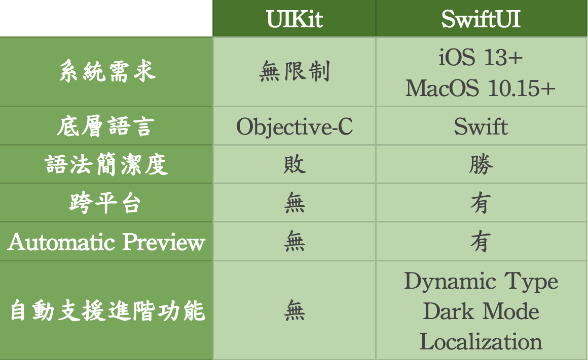
** SwiftUI vs UIKit: Benefits and Drawbacks
*** Drawbacks of SwiftUI [fn:2]
- It supports only iOS 13 and Xcode 11. By switching to them, you abandon users of older versions of iOS, which is a radical move devoid of concern for the user. But since Apple annually updates its list of supported iOS versions, I think SwiftUI will be used more over the next two years as users install the latest iOS version.
- It’s still very young, so there isn’t much data on [[https://stackoverflow.com/][Stack Overflow]]. This means that you can’t get much help resolving complicated issues.
- It doesn’t allow you to examine the view hierarchy in Xcode Previews.
*** Benefits of SwiftUI [fn:2]
- It’s easy to learn, and the code is simple and clean.
- It can be mixed with UIKit using UIHostingController.
- It allows you to easily manage themes. Developers can easily add dark mode to their apps and set it as the default theme, and users can easily enable dark mode. Besides, it looks awesome.
- SwiftUI provides mechanisms for reactive programming enthusiasts with BindableObject, ObjectBinding, and the whole Combine framework.
- It offers Live Preview. This is a very convenient and progressive way to see the results of code execution in real time without having to build. I’m not sure if it somehow affects the processor. So far, I’ve noticed a delay provoked by the use of Live Preview, but I think Apple will soon make improvements.
- SwiftUI no longer needs Interface Builder. It was replaced by Canvas, an interactive interface editor. When writing code, the visual part in Canvas is automatically generated, and when you create visual presentation elements, they automatically appear in the code.
- Your application will no longer crash if you forget to update the @IBOutlet association with the variable.
- There’s no AutoLayout or related problems. Instead, you use things like HStack, VStack, ZStack, Groups, Lists, and more. Unlike AutoLayout, SwiftUI always produces a valid layout. There’s no such thing as an ambiguous or unsatisfiable layout. SwiftUI replaces storyboards with code, making it easy to create a reusable view and avoid conflicts related with the simultaneous use of one project by the development team.

  #+latex:\newpage

* AppDelegate v.s. SceneDelegate v.s. <AppName>App
:PROPERTIES:
:CUSTOM_ID: delegate
:END:
** AppDelegate -> SceneDelegate
AppDelegate 原來的職責為負責 App 的生命週期和 UI 生命週期，在 Xcode11 後，AppDelegate 將 UI 的生命週期(Scene Session)交給 SceneDelegate。原 Xcode10使用 Swift 為 User Interface 的專案 Launch 的生命週期為 AppDelegate → ViewController，而使用 SwiftUI 為 User Interface 的專案則變成為 AppDelegate → SceneDelegate → ContentView，原本應該出現在 AppDelegate 的 applicationWillEnterForeground(_:) 等相關 App 到前、背景等相關的生命週期邏輯也都移至 SceneDelegate 裡了，method 名稱 application 的前綴字也都更改為 scene 了。[fn:3]
*** SceneDelegate.swift
#+BEGIN_SRC swift -r -n
import UIKit
import SwiftUI

class SceneDelegate: UIResponder, UIWindowSceneDelegate {

    var window: UIWindow?

    func scene(_ scene: UIScene, willConnectTo session: UISceneSession, options connectionOptions: UIScene.ConnectionOptions) {
        // Use this method to optionally configure and attach the UIWindow `window` to the provided UIWindowScene `scene`.
        // If using a storyboard, the `window` property will automatically be initialized and attached to the scene.
        // This delegate does not imply the connecting scene or session are new (see `application:configurationForConnectingSceneSession` instead).

        // Create the SwiftUI view that provides the window contents.
        let contentView = ContentView()

        // Use a UIHostingController as window root view controller.
        if let windowScene = scene as? UIWindowScene {
            let window = UIWindow(windowScene: windowScene)
            window.rootViewController = UIHostingController(rootView: contentView)
            self.window = window
            window.makeKeyAndVisible()
        }
    }

    func sceneDidDisconnect(_ scene: UIScene) {
        // Called as the scene is being released by the system.
        // This occurs shortly after the scene enters the background, or when its session is discarded.
        // Release any resources associated with this scene that can be re-created the next time the scene connects.
        // The scene may re-connect later, as its session was not neccessarily discarded (see `application:didDiscardSceneSessions` instead).
    }

    func sceneDidBecomeActive(_ scene: UIScene) {
        // Called when the scene has moved from an inactive state to an active state.
        // Use this method to restart any tasks that were paused (or not yet started) when the scene was inactive.
    }

    func sceneWillResignActive(_ scene: UIScene) {
        // Called when the scene will move from an active state to an inactive state.
        // This may occur due to temporary interruptions (ex. an incoming phone call).
    }

    func sceneWillEnterForeground(_ scene: UIScene) {
        // Called as the scene transitions from the background to the foreground.
        // Use this method to undo the changes made on entering the background.
    }

    func sceneDidEnterBackground(_ scene: UIScene) {
        // Called as the scene transitions from the foreground to the background.
        // Use this method to save data, release shared resources, and store enough scene-specific state information
        // to restore the scene back to its current state.
    }
}

struct SceneDelegate_Previews: PreviewProvider {
    static var previews: some View {
        /*@START_MENU_TOKEN@*/Text("Hello, World!")/*@END_MENU_TOKEN@*/
    }
}
#+END_SRC
#+latex:\newpage
** SceneDelegate -> <AppName>App
從程式的簡潔與效能來看，整段SceneDelegate只為了定義一個View(第76行)這其實不太合理，Apple在[[https://developer.apple.com/wwdc20/][WWDC20]]中提出了一個新的solution: App.
從Xcode 12 beta開始，開啟新專案時會多一個SwiftUI App的選項，原來的SceneDelegate.swiftx己消失，取而代之的是XXXApp.swift, XXX為專案名稱。
#+CAPTION: Xcode 11 v.s. Xcode 12
#+LABEL:fig:XcodeComparison
#+name: fig:XcodeComparison
#+ATTR_LATEX: :width 400
#+ATTR_ORG: :width 400
#+ATTR_HTML: :width 600
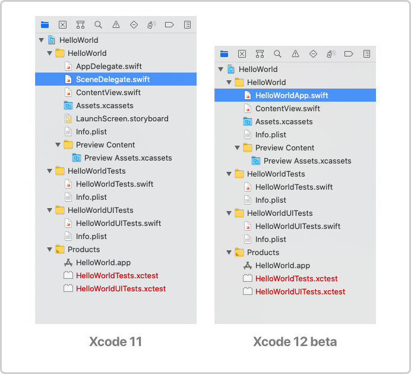
*** HelloApp.swift(專案名稱為Hello)
#+begin_src swift -r -n :results output :exports nil
//
//  NewAppApp.swift
//  NewApp
//
//  Created by yen yung chin on 2021/2/15.
//

import SwiftUI

@main
struct HelloApp: App {
    var body: some Scene {
        WindowGroup {
            ContentView()
        }
    }
}

#+end_src
- @main tells Xcode that the following struct, Hello, will be the entry point for the app. Only one struct can be marked with this attribute.
- According to the documentation, App is a protocol that “represents the structure and behavior of an app.” HelloWorldApp conforms to this. It’s like the base view of your app — no, the app itself. You’re literally writing out what your app will look like in this struct.
- Scene — The body of a SwiftUI View must be of type View. Similarly, the body of a SwiftUI App must be of type Scene…
- WindowGroup is a Scene that wraps views. The view that we want to present, ContentView, is a View — not a scene. WindowGroup lets us wrap them up into a single Scene that SwiftUI can recognize and display.
資料來源:[fn:4]

* 建立 SwiftUI Project
:PROPERTIES:
:CUSTOM_ID: SW-SWIFTUI-INTRO
:END:
** 教學影片
- [[https://www.youtube.com/watch?v=VlhcNR7Qrno][Your First SwiftUI App (Full Compilation!)]]
- [[https://www.youtube.com/watch?v=jbtqIBpUG7g][Lecture 1: Course Logistics and Introduction to SwiftUI]]: Stanford University CS193p
- [[https://www.youtube.com/watch?v=4GjXq2Sr55Q&t=5254s][Lecture 2: MVVM and the Swift Type System]]
- [[https://www.youtube.com/watch?v=uUMWEu2YJew&list=PLuoeXyslFTuZRi4q4VT6lZKxYbr7so1Mr][SwiftUI by Paul Hudson: Play All]]
- [[https://www.youtube.com/watch?v=uUMWEu2YJew][Understanding the basic structure of a SwiftUI app –  WeSplit SwiftUI Tutorial 1/10]]
- [[https://www.youtube.com/watch?v=BB3Gi4CGKrA][Creating a form – WeSplit SwiftUI Tutorial 2/10]]
- [[https://www.youtube.com/watch?v=K5628N_vTCs][Pushing new views onto the stack using NavigationLink – Moonshot SwiftUI Tutorial 3/10]]
- [[https://www.youtube.com/watch?v=46vqD5OPdys][Modifying program state – WeSplit SwiftUI Tutorial 4/10]]
- [[https://www.youtube.com/watch?v=IG1os9XXNiI&list=PLuoeXyslFTuZRi4q4VT6lZKxYbr7so1Mr&index=5][Binding state to user interface controls – WeSplit SwiftUI Tutorial 5/10]]
- [[https://www.youtube.com/watch?v=JGlWrqMbizI][SwiftUI - Calculator Demo from Stanford iOS Course Part 1 of 2]]
- [[https://www.youtube.com/watch?v=cjrAWGcpwJM][The Calculator (part 1) - Learn Swift UI]]
- [[https://www.youtube.com/watch?v=cbqMkIG6Qeg][Understanding MVVM Design Pattern]]: 講的超清楚
- [[https://www.youtube.com/user/azamsharp/videos][azamsharp SwiftUI Videos]]
- [[https://www.youtube.com/watch?v=nc-n5Gc8wN0][系列: Setting up - SwiftUI Starter Project 1/14]]
** 使用 SwiftUI 開啟新專案 [fn:3]
1) 首先，打開 Xcode，並點擊 Create new Xcode project。在 iOS 之下選擇 Single View App，並為專案命名。
2) 然後在下方勾選 Use SwiftUI 的選項，如果沒有勾選該選項的話，Xcode 會自動產生 storyboard 檔案(UIKit)。
3) Xcode 會自動幫你創建一個名為 ContentView.swif 的檔案，Xcode 會在程式碼的右邊呈現一個即時的預覽視窗(preview), 點選 resume 鈕生成預覽畫面(會花一點時間)。
*** ContentView.swift
#+BEGIN_SRC swift -r -n
import SwiftUI (ref:import)

struct ContentView: View { (ref:struct)
    var body: some View { (ref:vg)
        Text("文字") (ref:text)
    }
}

struct ContentView_Previews: PreviewProvider { (ref:preview)
    static var previews: some View {
        ContentView()
    }
}
#+END_SRC
- 第[[(import)]]行和 C++中的#include <iostream>同意，先匯入所需函式庫
- 第[[(struct)]]行說明有一個 struct 名為 ContentView，這個 ContentView conform(尊循)View 這個 Protocol，這代表必須有一個 some view 或回傳一個 some view
- 在 ContentView 中，有一個叫 body 的變數(第[[(vg)]]行)，這個 body 的回傳類型為 some view，some 為 swift 5.1 出現的新 keyword，屬於 opaque 回傳類型，代表它會回傳某些類型為 view 的值，至於實際回傳的是那一種類型的 view，swift 並不太在意
- 第[[(text)]]行的最前面省略了一個 return，意思是 body 這個 variable 最後會傳回一個 Text, 即，呈現在 View 上，body 只能回傳一個值，若 view 上面有許多物件，則需包含進一個 container 中，最後回傳這一個 container。
- 第[[(preview)]]行的 ContentView_Previews 負責產生預覧畫面。
** Text
*** 改變 Text 的屬性
- 改變 component 有兩種方式：工具列、code
- Attributes (modifier 的不同順序可能產生不同效果)
  + frame
  + foregroundColor
  + background
  + font
  + padding
  + cornerRadius

**** SwiftUI Inspector:
1) on Text object (in preview screen): CMD + click
2) select *Show SwiftUI Inspector*
3) change *Text*, *Font*, *Color*
4) Monitor the corresponding code changes in code window
#+CAPTION: SwiftUI Inspector
#+LABEL:fig:Inspector-1
#+name: fig:Inspector-1
#+ATTR_LATEX: :width 300
#+ATTR_ORG: :width 300
#+ATTR_HTML: :width 600
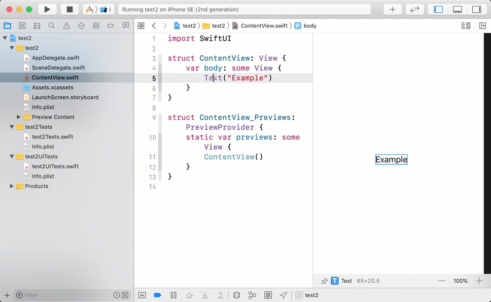
**** Inspector frame
#+CAPTION: SwiftUI Inspector
#+LABEL:fig:inspector-2
#+name: fig:inspector-2
#+ATTR_LATEX: :width 300
#+ATTR_ORG: :width 300
#+ATTR_HTML: :width 600
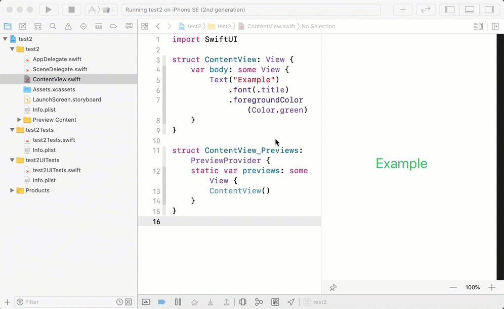
**** code
於 Text("...")後加上屬性 function 或修改其他屬性
#+CAPTION: SwiftUI Change Attributes
#+LABEL:fig:ChangeAttribute
#+name: fig:ChangeAttribute
#+ATTR_LATEX: :width 300
#+ATTR_ORG: :width 300
#+ATTR_HTML: :width 600
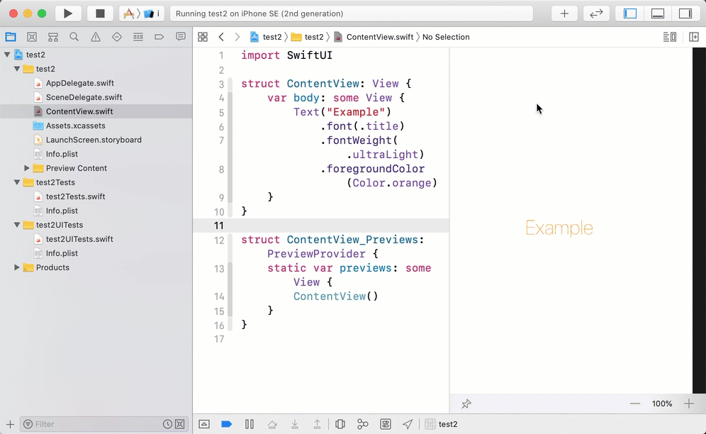
** Stack
一個以上的物件都要放在 Stack 中，Stack 可分為以下三類
- VStack: 垂直排列
- HStack: 水平排列
- ZStack: 上下排列(重叠)
*** Stack 與 Stack 可相互包含，於 View 中加入 Stack 的方式有二:
**** 由工具列 drag: Xcode 會自動加入相對的 code
#+CAPTION: Drag component from toolbar
#+LABEL:fig:VStack
#+name: fig:VStack
#+ATTR_LATEX: :width 300
#+ATTR_ORG: :width 300
#+ATTR_HTML: :width 600
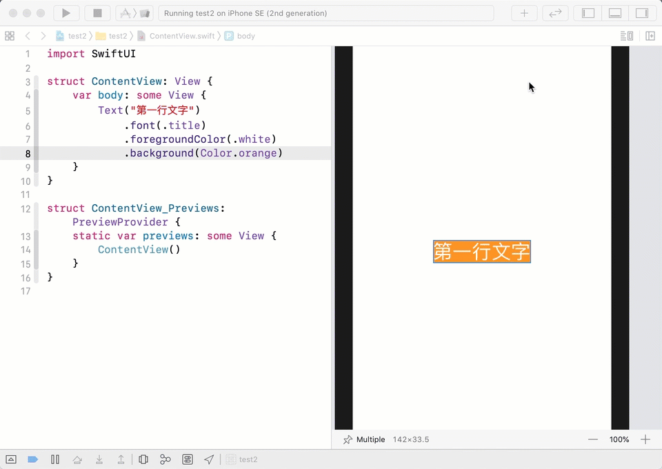
**** coding
#+begin_src swift -r -n :results output :exports both
import SwiftUI

struct ContentView: View {
    var body: some View {
        VStack {
            Text("第一行文字")
            Text("第二行文字")
        }
    }
}

struct ContentView_Previews: PreviewProvider {
    static var previews: some View {
        ContentView()
    }
}
#+end_src

#+RESULTS:

#+CAPTION: VStack
#+LABEL:fig:VStack-1
#+name: fig:VStack-1
#+ATTR_LATEX: :width 300
#+ATTR_ORG: :width 300
#+ATTR_HTML: :width 300

*** SwiftUI 撰寫原則
- body 恆為只能 return 一物件。
- 若有多個物件時，一定得放在 Stack 裡。
*** HStack DEMO
#+begin_src swift -r -n :eval no
import SwiftUI

struct ContentView: View {
    var body: some View {
        HStack {
            VStack {
                Button("請按我") {
                    print("TEST")
                }
                .frame(width: 60, height: 30, alignment: .center)
                .foregroundColor(.white)
                .background(Color.green)
                Button("別亂按") {
                    print("QQ")
                }
            }
            VStack {
                Text("第一行文字")
                    .frame(width: 100, height: 30, alignment: .center   )
                    .foregroundColor(.white)
                    .background(Color.orange)
                Text("第二行文字")
                    .frame(width: 100, height: 30, alignment: .center)
                    .foregroundColor(.white)
                    .background(Color.red)
            }
        }
    }
}

struct ContentView_Previews: PreviewProvider {
    static var previews: some View {
        ContentView()
    }
}
#+end_src
#+CAPTION: HStack
#+LABEL:fig:HStack-1
#+name: fig:HStack-1
#+ATTR_LATEX: :width 300
#+ATTR_ORG: :width 300
#+ATTR_HTML: :width 300

* Basic Components
** Image
影像來源可以是 System Image 或自行下載/編修的影像(Customized Image)
*** 使用系統內建的圖
**** [[https://developer.apple.com/design/human-interface-guidelines/sf-symbols/overview/][SF Symbols ]][fn:5]
**** 從 iOS 13 開始，Apple 介紹了一個名為 SFSymbols 的新功能。SF Symbols 這功能由 Apple 所設計，當中集合了 1500 多個可以在 App 之中使用的符號。[fn:3]
**** [[https://developer.apple.com/design/resources/][Download SF Symbols app]]
**** code
#+begin_src swift -r -n :eval no
import SwiftUI

struct ContentView: View {
    var body: some View {
        VStack {
            Text("System Image")
                .font(.headline)
                .foregroundColor(.orange)
            Image(systemName: "icloud")
            .resizable()
            .scaledToFit()
            .frame(width: 100, height: 80, alignment: .center)
        }
    }
}

struct ContentView_Previews: PreviewProvider {
    static var previews: some View {
        ContentView()
    }
}
#+end_src
**** Demo
#+CAPTION: Images-1
#+LABEL:fig:Images-1
#+name: fig:Images-1
#+ATTR_LATEX: :width 300
#+ATTR_ORG: :width 300
#+ATTR_HTML: :width 300

*** 使用自己的圖
1) Drag image into Project folder *Assets.xcassets*
2) Add following code
#+begin_src swift -r -n :eval no
Image("ImageName") //file name in Assets.xcassets
  .resizable()
  .scaledToFit()
  .frame(width: 200, height: 160, alignment: .center)
#+end_src
*** Image Attributes
#+begin_src swift -r -n :eval no
import SwiftUI

struct ContentView: View {
    var body: some View {
        VStack {
            Text("Albert Camus")
                .font(.title)
                .foregroundColor(.white)
                .background(Color.orange)
            Image("Albert-Camus")
                .resizable()
                .scaledToFill()
                .frame(width: 200, height: 200, alignment: .center)
                .clipShape(Circle())

        }
    }
}

struct ContentView_Previews: PreviewProvider {
    static var previews: some View {
        ContentView()
    }
}
#+end_src
#+CAPTION: Images-2
#+LABEL:fig:Images-2
#+name: fig:Images-2
#+ATTR_LATEX: :width 300
#+ATTR_ORG: :width 300
#+ATTR_HTML: :width 300

*** Using SF Symbols
- SF Symbols app
- [[https://sfsymbols.com/][sfsymbols.com]]
- [[https://www.avanderlee.com/swift/sf-symbols-guide/][SF Symbols: The benefits and how to use them guide]]

** Button
*** 語法
#+begin_src swift -r -n :eval no
//...
Button("Title") {
    //action
}

Button(action: <#T##() -> Void#>, label: <#T##() -> _#>)
//...
#+end_src
*** 將變數加入 View 中
#+begin_src swift -r -n :eval no
struct ContentView: View {
    var title = "Hello SWiftUI"

    var body: some View {
        VStack {
            Text(verbatim: title)
                .padding(4)
                .foregroundColor(.white)
                .background(Color.gray)
        }
    }
}
#+end_src
*** 如何於程式中改變 title 的值來改變 View 的顯示內容?
解決方案: @State
如以下範例:
#+begin_src swift -r -n :eval no
struct ContentView: View {
    @State var title = "Hello SWiftUI"

    var body: some View {
        VStack {
            Text(verbatim: title)
                .padding(4)
                .foregroundColor(.white)
                .background(Color.gray)
        }
    }
}
#+end_src
View 為 struct，未加上 @State 的變數是不允許變更的(immutable)；加了 @State 後，SwiftUI 將認為這個變數(或，struct 的 property)代表某種影將 View 畫面或內容的狀態，並在背後另外產生空間儲存 property 的內容，它不再儲存在 ContentView 裡，因此我們可以修改它的內容[fn:6]。

以 @State 宣告的 property 有個重要的特性，只要它的內容改變，畫面也會立即更新。它帶來了以下兩個好處:
- 不用另外寫 property 內容改變時更新畫面的程式。
- 不用擔心畫面顯示的內容跟 property 的內容不同步，比方修改了 property，但卻忘了更新畫面。

那麼，要在什麼地方去改變 title 的值?
*** 範例: 按下 Button，改變 Text title
#+begin_src swift -r -n :eval no
struct ContentView: View {
    @State var title = "Hello SWiftUI"

    var body: some View {
        VStack {
            Text(verbatim: title)
                .padding(4)
                .foregroundColor(.white)
                .background(Color.gray)
            Button("Click Me") {
                self.title = "QQ"
            }
        }
    }
}
#+end_src
*** 以 Button 開啟一個新的 View
一個 app 當然不會只有一個 View，我們可以透過 NavigationLink 來控制一系列 View 的呈現，也可以簡單的以 Button 來控制。
在下例中，按下 BUtton 後會秀出 SecondView，而 SwiftUI 控制一個新 View 的方式是透過 sheet(isPreseted)中 isPresented 的 true/false。
ContentView.swift
#+begin_src swift -r -n :results output :exports nil
import SwiftUI

struct ContentView: View {
    @State var showSecondView = false (ref:controlView)
    var body: some View
    {
        Button(action: {
            self.showSecondView = true (ref:changeShow)
        }, label: {
            Text("打開一個新的View")
        }).sheet(isPresented: self.$showSecondView, content: { (ref:whichView)
            SecondView()
        })
    }
}

struct ContentView_Previews: PreviewProvider {
    static var previews: some View {
        ContentView()
    }
}

#+end_src
Button 藉由 sheet 裡的 contet 來指定要打開的是哪一個 View(第[[(whichView)]]行，在此例中目標 View 為 SecondView)，而真正控制是否秀出這個 View 的變數為 showSecondView 這個 bool(第[[(controlView)]])，之所以按下 Button 後能秀出 SecondView，是因為在 Button 的 action 中，我們把 showSecondView 的值改為 true(第[[(changeShow)]]行)。SecondView.swift 的內容如下:
#+begin_src swift -r -n :results output :exports nil
import SwiftUI

struct SecondView: View {
    var body: some View {
        Text("I'm second View")
    }
}

struct SecondView_Previews: PreviewProvider {
    static var previews: some View {
        SecondView()
    }
}

#+end_src
而此例執行結果為:
#+CAPTION: Show New View
#+NAME: fig:ShowNewView
#+ATTR_LATEX: :width 300
#+ATTR_ORG: :width 300
#+ATTR_HTML: :width 300
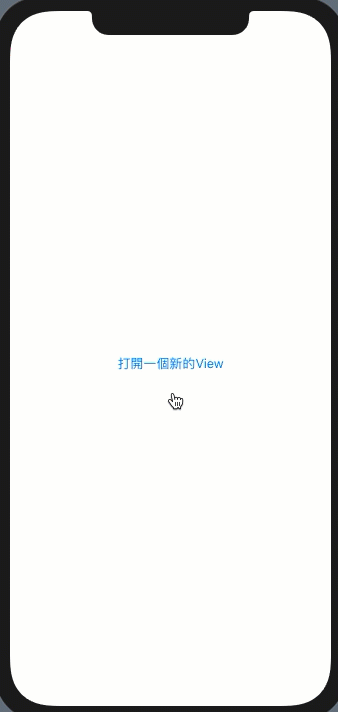
*** 以 Button 關閉 View
在上例中，把 SecondView 關掉的方式為往下滑動螢幕，另一種關掉的方式是加上一個 Button:
#+begin_src swift -r -n :results output :exports nil
import SwiftUI

struct ContentView: View {
    @State var showSecondView = false
    var body: some View {
        Button(action: {
            self.showSecondView = true
        }, label: {
            Text("打開一個新的View")
        }).sheet(isPresented: self.$showSecondView, content: {
            SecondView(showMe: self.$showSecondView) (ref:Binding1)
        })
    }
}

struct ContentView_Previews: PreviewProvider {
    static var previews: some View {
        ContentView()
    }
}

#+end_src
上述程式碼與前節唯一的差異在第[[(Binding1)]]行，此處我們把控制 SecondView 是否出現的變數 showSecondView 傳給 SecondView。
#+begin_src swift -r -n :results output :exports nil
import SwiftUI

struct SecondView: View {
    @Binding var showMe: Bool (ref:Binding2)
    var body: some View {
        VStack {
        Text("I'm second View")
            Button(action: {
                    self.showMe = false (ref:Binding3)
            }, label: {
                Text("Close me")
            })
        }
    }
}

struct SecondView_Previews: PreviewProvider {
    static var previews: some View {
        SecondView(showMe: .constant(false)) (ref:Binding4)
    }
}
#+end_src
在 SecondView.swift 中，以 showMe「接住」來自 ContentView 的共享變數(showSecondView)(第[[(Binding2)]]行)，然後在 Buuton 的 action 中將 showMe 的值改為 false(第[[(Binding3)]]行)，這同時也就是把 ContentView 中的 showSecondView 的值由 true 改為 false，然後 SecondView 就被關掉了。
由於 SecondView 中宣告了一個@Binding 變數，所有呼叫這個 View 的程式碼都要傳這個變數給它，例如 ContentView 中的
#+begin_src swift -r -n :results output :exports nil
SecondView(showMe: self.$showSecondView)
#+end_src
同樣的，SecondView 最底下負責產生 app 預覽畫面的 SecondView_Previews 也要提供這個參數，不過，由於它只是產生預覽畫面，與程式 h 執行無實際影響，所以我們可以隨便傳個 true/false 轉為常數給它就行，如上例中的第[[(Binding4)]]行。執行結果如下:
#+CAPTION: Close New View
#+NAME: fig:CloseNewView
#+ATTR_LATEX: :width 300
#+ATTR_ORG: :width 300
#+ATTR_HTML: :width 300
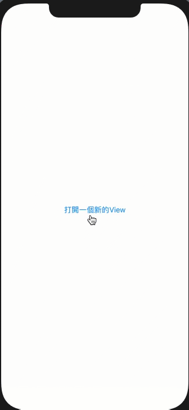

* Passing data within View: TextField
** 語法
#+begin_src swift -r -n :eval no
@State private var 變數="值"
TextField("提示文字", text: $變數)
#+end_src
** 範例: 於 TextField 輸入資料，顯示於 Text 中
即，利用@State宣告一個可以讓Text和TextField共享的變數
#+begin_src swift -r -n :eval no
import SwiftUI

struct ContentView: View {
    @State private var title = "" (ref:StateVar)

    var body: some View {
        VStack {
            Text(verbatim: "Hello "+title) (ref:strTitle)
            HStack {
                Text("Your Name: ")
                TextField("請輸入姓名:", text: $title) (ref:dollarSign)

            }
        }
    }
}
#+end_src
執行結果如下
#+CAPTION: Button
#+LABEL:fig:Button-1
#+name: fig:Button-1
#+ATTR_LATEX: :width 300
#+ATTR_ORG: :width 300
#+ATTR_HTML: :width 300

在上述程式中，我們希望在 *TextField* 中輸入文字時就能即時改變 title 的值，便要做綁定(Binding)的動作，也就是在 *TextField* 中 title 前加上一個$ (第[[(dollarSign)]]行)，由 *TextField* 的語法也可以看出: TextField(<titleKey: LocalizedStringKey, text: Binding<String>)。SwiftUI 便是透過「在@State property 前加上$」的方式來取得這個 property 的 binding，當第[[(dollarSign)]]的值一改變，第[[(strTitle)]]行的 Text 也會即時跟著改變，這便是 binding 的作用。

除了 *TextField* 之外，SwiftUI 還有許多提供 *Binding* 的元件，例如：Toggle, Slider, DatePicker...。
** 範例 2: @state struct
當在 View 中有許多變數的值需要 Binding 時，一個一個加入@State property 有點太麻煩，此時可以將這些相關變數組合為一 struct，如下例：
#+begin_src swift -r -n :results output :exports nil
struct User {
    var firstName = "Bilbo"
    var lastName = "Baggins"
}
#+end_src
We can now use that in a SwiftUI view by creating an @State property and attaching things to $user.firstName and $user.lastName, like this:
#+begin_src swift -r -n :results output :exports nil
struct ContentView: View {
    @State private var user = User()

    var body: some View {
        VStack {
            Text("Your name is \(user.firstName) \(user.lastName).")

            TextField("First name", text: $user.firstName)
            TextField("Last name", text: $user.lastName)
        }
    }
}
#+end_src
That all works: SwiftUI is smart enough to understand that one object contains all our data, and will update the UI when either value changes. Behind the scenes, what’s actually happening is that each time a value inside our struct changes the whole struct changes – it’s like a new user every time we type a key for the first or last name. That might sound wasteful, but it’s actually extremely fast.
** What is @State
用途:在同一 View 中給不同元件共享(變更)變數，而且這種共享是雙向的，即，任何一端變更了變數的值，另一端都會立即更新。@tate 的相關特性如下：
- State is a value, or a set of values, that can change over time, and that affects a view’s behavior, content, or layout. You use a property with the @State attribute to add state to a view.
- 通過使用 @State 修飾器我們可以關聯出 View 的狀態. SwiftUI 將會把使用過 @State 修飾器的屬性存儲到一個特殊的內存區域(heap)，並且這個區域和 View struct 是隔離的. 當 @State 裝飾過的屬性發生了變化，SwiftUI 會根據新的屬性值重新創建 View。[fn:7]
- Simple properties like String or Int
- Belongs to a specific view
- Never used outside that view
- The wrappedValue is: anything (but almost certainly a value type).
- What it does: stores the wrappedValue in the heap; when it changes, invalidates the View.
- Projected value (i.e. $): a Binding (to that value in the heap).

* Customize UI Components
:PROPERTIES:
:CUSTOM_ID: SW-CUSTOMIZED-UI-COMPONENTS
:END:
SwiftUI 提供豐富的 modifier 幫助我們設計客製 UI 元件的樣式，諸如陰影，旋轉等效果皆可透過 modifier 實現，還可以搭配方便的拖曳加入相關程式碼。[fn:8]
** Text
*** Advanced Attributes [fn:8]
#+begin_src swift -r -n :eval no
struct ContentView: View {
    var body: some View {
        Text("Example")
          .font(.title)
          .fontWeight(.bold)
          .foregroundColor(Color.white)
          .padding(4)
          .background(Color.gray)
          .cornerRadius(14.0)
          .rotationEffect(Angle(degrees: 15))
          .rotation3DEffect(Angle(degrees: 30), axis: (x: 10, y: 30, z: 30))
          .shadow(radius: 20)
    }
}
#+end_src
*** Demo
#+CAPTION: Text Attributes
#+LABEL:fig:Adv-Text_Attributes
#+name: fig:Adv-Text_Attributes
#+ATTR_LATEX: :width 300
#+ATTR_ORG: :width 300
#+ATTR_HTML: :width 300

** Image
*** Advanced Attributes s[fn:9]
#+begin_src swift -r -n :eval no
import SwiftUI

struct ContentView: View {
    var body: some View {
        VStack {
            Text("Albert Camus")
              .font(.body)
              .foregroundColor(.white)
              .background(Color.orange)
            Image("Albert-Camus")
              .resizable()
              .scaledToFill()
              .frame(width: 100, height: 100, alignment: .center)
              .clipShape(Circle())
            Image(systemName: "alarm.fill")
              .resizable()
              .scaledToFill()
              .frame(width: 100, height: 100, alignment: .center)
            Image("Albert-Camus")
              .frame(width: 100, height: 100, alignment: .center)
              .mask(Image(systemName: "alarm.fill")
                      .resizable()
                      .scaledToFit())
              .shadow(radius: 20)
        }
    }
}

struct ContentView_Previews: PreviewProvider {
    static var previews: some View {
        ContentView()
    }
}

#+end_src
*** Demo
#+CAPTION: Image Attributes
#+LABEL:fig:Adv-Image-Attributes
#+name: fig:Adv-Image-Attributes
#+ATTR_LATEX: :width 300
#+ATTR_ORG: :width 300
#+ATTR_HTML: :width 300
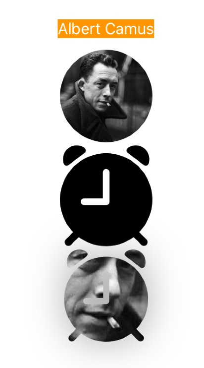
** Button II
*** 外觀控制
**** Advanced Attributes [fn:10]
#+begin_src swift -r -n :eval no
import SwiftUI

struct ContentView: View {
    var body: some View {
        VStack(spacing: 5.0) {
            Text("Customized Button")
              .font(.body)
              .foregroundColor(.white)
              .background(Color.orange)
            Button(action: {
                       print("Hello button tapped!")
                   }) {
                Text("HI HI")
                  .fontWeight(.bold)
                  .font(.title)
                  .foregroundColor(.purple)
                  .padding()
                  .border(Color.purple, width: 5)
            }
            Button(action: {
                       print("Hello button tapped!")
                   }) {
                Text("Press me")
                  .fontWeight(.light)
                  .font(.title)
                  .foregroundColor(.green)
                  .padding(5)
                  .overlay(
                    Capsule(style: .continuous)
                      .stroke(Color.green, style: StrokeStyle(lineWidth: 3, dash: [10]))
                  )
            }
        }
    }
}

#+end_src
**** Demo
#+CAPTION: Button Attributes
#+LABEL:fig:Adv-Button-Attributes
#+name: fig:Adv-Button-Attributes
#+ATTR_LATEX: :width 300
#+ATTR_ORG: :width 300
#+ATTR_HTML: :width 300
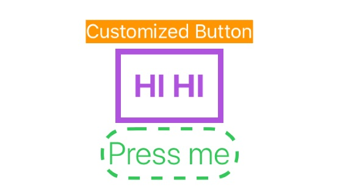
*** Button v.s. @State
#+begin_src swift -r -n :eval no
import SwiftUI

struct ContentView: View {
    @State private var a = ""
    @State private var b = ""
    @State private var c = "Ans:"

    var body: some View {
        VStack {
            VStack {
                Divider()
                TextField("Number 1: ", text: $b)
                Divider()
                TextField("Number 2:", text: $a)
                Divider()
                Button("➕") {
                    let one = Int(self.a) ?? 0
                    let two = Int(self.b) ?? 0
                    self.c = "Ans: " + String(one + two)
                }
                  .frame(width: 40, height: 30, alignment: .center)
                  .foregroundColor(.white)
                  .background(Color.green)
                  .font(.largeTitle)
                Divider()
                Text(verbatim: c)
                  .foregroundColor(.gray)
            }
              .frame(width: 200, height: 160, alignment: .center)
        }
    }
}
#+end_src
#+CAPTION: Button
#+LABEL:fig:Button-1
#+name: fig:Button-1
#+ATTR_LATEX: :width 300
#+ATTR_ORG: :width 300
#+ATTR_HTML: :width 300
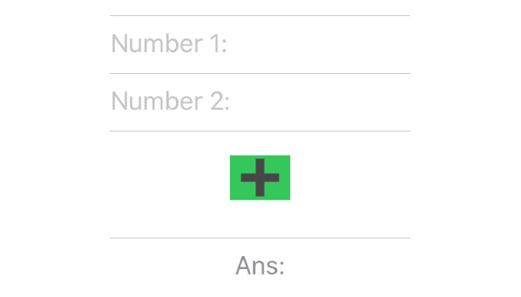
** background, opacity
#+begin_src swift -r -n :eval no
//
//  ContentView.swift
//  uitest
//
//  Created by yen yung chin on 2020/7/29.
//  Copyright © 2020 Letranger.tw. All rights reserved.
//

import SwiftUI

struct ContentView: View {
    @State private var a = ""
    @State private var b = ""
    @State private var c = "Ans:"

    var body: some View {
        VStack(alignment: .center) {
            Text("計算機")
            Divider()
            TextField("Number 1: ", text: $b)
            Divider()
            TextField("Number 2:", text: $a)
            Divider()
            Button("➕") {
                let one = Int(self.a) ?? 0
                let two = Int(self.b) ?? 0
                self.c = "Ans: " + String(one + two)
            }
              .frame(width: 40, height: 30, alignment: .center)
              .foregroundColor(.white)
              .background(Color.white)
              .font(.largeTitle)
            Divider()
            Text(verbatim: c)
              .foregroundColor(.black)

        }
          .padding(60)
          .background(Image("background").resizable().scaledToFill())
          .opacity(0.9)
    }
}
struct ContentView_Previews: PreviewProvider {
    static var previews: some View {
        ContentView()
    }
}

#+end_src
#+CAPTION: Background
#+LABEL:fig:Background-1
#+name: fig:Background-1
#+ATTR_LATEX: :width 300
#+ATTR_ORG: :width 300
#+ATTR_HTML: :width 300
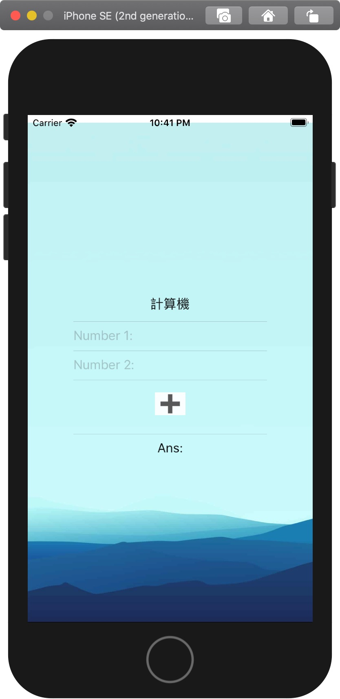
** Further reading
- [[https://www.simpleswiftguide.com/advanced-swiftui-button-styling-and-animation/][Advanced SwiftUI button styling and animation]]

* List
:PROPERTIES:
:CUSTOM_ID: list
:END:
** What is List
SwiftUI 的列表視圖 (List View) 其實和 UIKit 的表格視圖 (Table View) 很類似，它們都是讓開發者把項目一列列地呈現，而預設設定上，每一列資料都會用分隔線 (line separator) 分開。
#+begin_src swift -r -n :results output :exports nil
struct ContentView: View {
    var body: some View {
        List {
            Text("Hello world.")
            Text("Hello world.")
            Text("Hello world.")
        }
    }
}
#+end_src
** 準備單一 cell 格式
#+begin_src swift -r -n :eval no
import SwiftUI

struct ContentView: View {
    var body: some View {
        HStack {
            Image(systemName: "book")
              .resizable()
              .frame(width: 30, height: 30, alignment: .center)
            VStack(alignment: .leading) {
                Text("Artificial Intelligence: A Modern Approach")
                  .multilineTextAlignment(.leading)
                  .foregroundColor(Color.green)
                Text("Stuart Russell and Peter Norvig")
                  .multilineTextAlignment(.leading)
                  .foregroundColor(Color.orange)
            }
        }
    }
}

#+end_src
#+CAPTION: Single cell
#+LABEL:fig:single-cell
#+name: fig:single-cell
#+ATTR_LATEX: :width 300
#+ATTR_ORG: :width 300
#+ATTR_HTML: :width 300
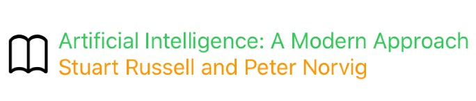
** 轉入 List 格式(靜態 List)
*** 將最外層的 VStack 加入 List 中
#+CAPTION: List-1
#+LABEL:fig:list-1
#+name: fig:list-1
#+ATTR_LATEX: :width 400
#+ATTR_ORG: :width 400
#+ATTR_HTML: :width 500
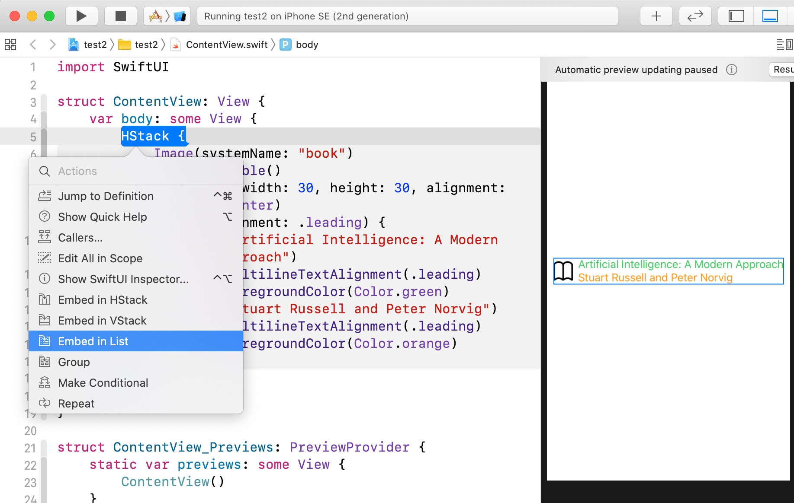
*** list 語法
#+begin_src swift -r -n :eval no
import SwiftUI

struct ContentView: View {
    var body: some View {
        List(0 ..< 5) { item in
            Image(systemName: "book")
              .resizable()
              .frame(width: 30, height: 30, alignment: .center)
            VStack(alignment: .leading) {
                Text("Artificial Intelligence: A Modern Approach")
                  .multilineTextAlignment(.leading)
                  .foregroundColor(Color.green)
                Text("Stuart Russell and Peter Norvig")
                  .multilineTextAlignment(.leading)
                  .foregroundColor(Color.orange)
            }
        }
    }
}
#+end_src
*** 結果
#+CAPTION: List-2
#+LABEL:fig:list-2
#+name: fig:list-2
#+ATTR_LATEX: :width 400
#+ATTR_ORG: :width 400
#+ATTR_HTML: :width 500
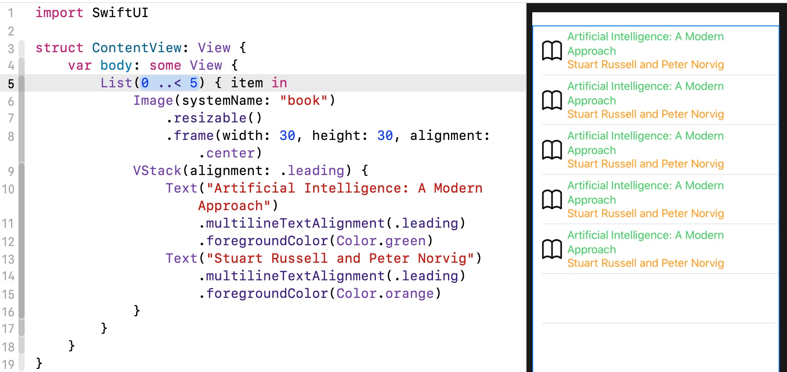
** 建立 list 來源資料(動態 List) [fn:3]
#+begin_verse
In order to handle dynamic items, you must first tell SwiftUI how it can identify which item is which. This is done using the Identifiable protocol, which has only one requirement: some sort of id value that SwiftUI can use to see which item is which. [fn:11]
#+end_verse
#+begin_src swift -r -n :eval no
import SwiftUI

//建立book struct
struct Book: Identifiable {
    var id = UUID()
    var title: String
    var author: String
    var image: String
}

struct ContentView: View {
    var books = [
      Book(id: UUID(), title: "地獄藍調", author: "李查德", image: "b1"),
      Book(id: UUID(), title: "至死方休", author: "李查德", image: "b2"),
      Book(id: UUID(), title: "一觸即發", author: "李查德", image: "b3"),
      Book(id: UUID(), title: "索命訪客", author: "李查德", image: "b4"),
      Book(id: UUID(), title: "闇夜回聲 ", author: "李查德", image: "b5")]

    //.....
}
#+end_src
** 將資料連結到列表中 [fn:3]
#+begin_src swift -r -n :eval no
import SwiftUI

//....
var body: some View {
    List(books) { book in
        Image(book.image)
          .resizable()
          .frame(width: 40, height: 40, alignment: .center)
        VStack(alignment: .leading) {
            Text(book.title)
              .multilineTextAlignment(.leading)
              .foregroundColor(Color.green)
            Text(book.author)
              .multilineTextAlignment(.leading)
              .foregroundColor(Color.orange)
        }
    }
}
}
#+end_src
** 結果
#+CAPTION: List-3
#+LABEL:fig:list-3
#+name: fig:list-3
#+ATTR_LATEX: :width 300
#+ATTR_ORG: :width 300
#+ATTR_HTML: :width 300
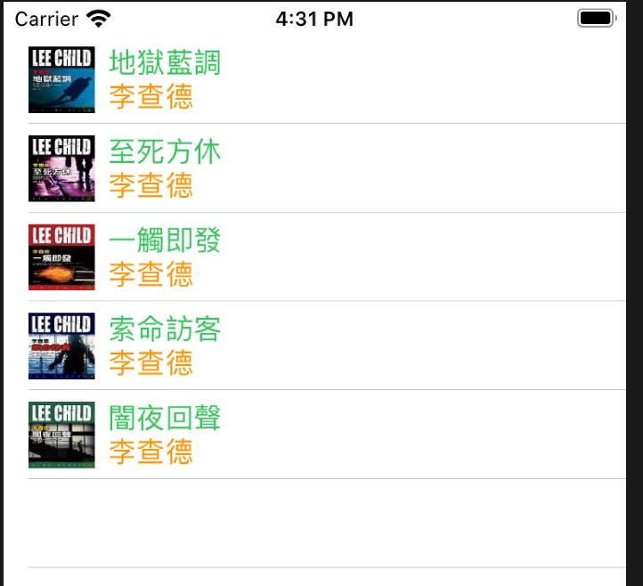
** 為什麼要加入 id 與 Identifiable
- Identifiable: 允許 Array 中有重複值
- id: 明確區分重複值
- UUID: 自動生成 unique 值
- 詳細說明如[[https://medium.com/flawless-app-stories/swiftui-dynamic-list-identifiable-73c56215f9ff][SwiftUI - Dynamic List & Identifiable]]
** Reading source
- [[https://www.youtube.com/watch?v=bz6GTYaIQXU][SwiftUI Basics: Dynamic Lists, HStack VStack, Images with Circle Clipped Stroke Overlays]]
- [[https://developer.apple.com/tutorials/swiftui/building-lists-and-navigation][Building Lists and Navigation]]

#+latex:\newpage
** Action on List
*** Swipe to Edit/Delete
[[https://www.youtube.com/watch?v=Zmh9uFdBLgE][Swipe Actions in SwiftUI]]
*** Pull to Refresh
[[https://www.youtube.com/watch?v=zbSvO6ItmeU][Pull to Refresh in SwiftUI]]
* Passing data between Views #1: @Binding
:PROPERTIES:
:CUSTOM_ID: StateBinding
:END:
用途:不同 View 間共享變數
- @Binding is one of SwiftUI’s less used property wrappers, but it’s still hugely important: it lets us declare that one value actually comes from elsewhere, and should be shared in both places. This is not the same as @ObservedObject or @EnvironmentObject, both of which are designed for reference types to be shared across potentially many views.[fn:12]
- 有時候我們會把一個視圖的屬性傳至子節點中，但是又不能直接的傳遞給子節點，因為在 Swift 中值的傳遞形式是值類型傳遞方式，也就是傳遞給子節點的是一個拷貝過的值。但是通過 @Binding 修飾器修飾後，屬性變成了一個引用類型，傳遞變成了引用傳遞，這樣父子視圖的狀態就能關聯起來了。[fn:7]
- The wrappedValue is: a value that is bound to something else.
- What it does: gets/sets the value of the wrappedValue from some other source.
- What it does: when the bound-to value changes, it invalidates the View.
** Time to use Binding
Bindings are all about having a *single source of the truth (data)!*.
- Getting text out of a TextField
- Using a Toggle or other state-modifying UI element
- Finding out which item in a NavigationView was chosen.
- Find out whether we're being targeted with a Drag
- Binding our gesture to the .updating function of a gesture.
** Demo 1: @State v.s. @Bidning
透過@State 與@Bidning, ContentView.swift 可以將變數 switchIsOn pass 給 SwitchView.swift，而後者可以藉由更改變數值來改變 ContentView.swift 的顯示結果。
*** ContentView.swift
#+begin_src swift -r -n :eval no
import SwiftUI

struct ContentView: View {
    @State var switchIsOn = false

    var body: some Vie {
        VStack {
            Text(switchIsOn ? "-_-" : "^_^")
            SwitchView(switchIsOn: $switchIsOn)
        }
    }
}
#+end_src
*** SwitchView.swift
#+begin_src swift -r -n :eval no
import SwiftUI

struct SwitchView: View {
    @Binding var swtichIsOn: Bool

    var body: some View {
        Toggle(isOn: $switchIsOn, label: {
            Text(switchIsOn ? "ON" : "OFF")
        })
    }
}
#+end_src
** Demo 2: Sharing multiple variable
建立一個 User struct，透過@Binding 與其他 View 共享 struct 裡的變數
*** User.swift
#+begin_src swift -r -n :results output :exports nil
import Foundation

struct User {
    var firstName: String
    var lastname: String
    var VIP: Bool
    init() {
        firstName = "Brown"
        lastname = "Charlie"
        VIP = false
    }
}

#+end_src
*** ContentView.swift
建立一個可以其他 View 共享的 struct variable (user)，將 user struct 傳給 EditUser 進行編輯
#+begin_src swift -r -n :results output :exports nil
import SwiftUI

struct ContentView: View {
    @State var showEdit: Bool = false
    @State var user = User()

    var body: some View {
        VStack {
            Text("User: \(user.lastname) \(user.firstName)")
            if user.VIP {
                Text("VIP")
            } else {
                Text("Regular user")
            }
            Button("Edit") {
                self.showEdit = true
            }.sheet(isPresented: self.$showEdit, content: {
                EditUser(user: $user)
            })
        }.padding()
    }
}

struct ContentView_Previews: PreviewProvider {
    static var previews: some View {
        ContentView()
    }
}
#+end_src
*** EditUser.swift
以@Bidning 接收來自 ContentView 的 user
#+begin_src swift -r -n :results output :exports nil
import SwiftUI

struct EditUser: View {
    @Binding var user: User
    var body: some View {
        VStack {
        TextField("First Name", text: $user.firstName)
            TextField("Last Name", text: $user.lastname)
            Toggle("VIP", isOn: $user.VIP)
        }
    }
}

struct EditUser_Previews: PreviewProvider {
    static var previews: some View {
        EditUser(user: .constant(User()))
    }
}
#+end_src

* Alert
:PROPERTIES:
:CUSTOM_ID: Alert
:END:
目的: 跳出對話視窗
** 以 Button 觸發
和呼叫其他 View 一樣，仍然是以一個 bool 來控制是否秀出 Alert
#+begin_src swift -r -n :results output :exports nil
struct SecondView: View {
    @State private var showAlert:Bool = false
    var body: some View {
        Button("請按我") {
            showAlert = true
        }.alert(isPresented: $showAlert, content: {
                                             return Alert(title: Text("別亂按"))
                                         })
    }
}
#+end_src
** 以 TextField 觸發
將控制顯示的 boo 值寫在 *onCommit*
#+begin_src swift -r -n :results output :exports nil
struct SecondView: View {
    @State private var title:String = ""
    @State private var showAlert:Bool = false
    var body: some View {
        TextField("To be or not to be", text: $title, onCommit:  {
                                                          showAlert = true
                                                      })
          .alert(isPresented: $showAlert, content: {
                                              return Alert(title: Text("\(title)"))
                                          })

    }
}
#+end_src

#+LATEX: \newpage

* Navigation between Views
** Tabbed View
Tab bar 是在 App 螢幕底部出現的欄，提供了在不同的版面之間進行快速切換的途徑。Tab bar 的背景顏色是半透明，可以有調色。Tab bar 在所有螢幕尺寸都保持一樣的高度，並且在鍵盤時出現會隱藏起來。

一個 tab bar 可以包含無數個 tab，但可以能容納的數量視乎根據手機/平板的大小，以及橫、豎屏模式都會有所影響。在空間的限制下，當某些 tab 無法被顯示時，最後一個 tab 會變成“更多”(More)， 通過這個 tab 可以到另一個獨立的列表頁面，那裡會列出所有無法被顯示的 tab。[fn:13]
*** Create subView
#+begin_src swift -r -n :results output :exports nil
import SwiftUI

struct tabView: View {

    init() {
        UITabBarItem.appearance().setTitleTextAttributes([.font: UIFont.systemFont(ofSize: 16) ], for: .normal)
    }

    var body: some View {
        TabView {
            StoreView().tabItem {
                Image(systemName: "cart.fill.badge.plus")
                Text("購買")
            }
            AboutView().tabItem {
                Image(systemName: "person.3")
                Text("關於")
            }
            NewsView().tabItem {
                Image(systemName: "message")
                Text("消息")
            }
        }.accentColor(.pink)    }
}

struct StoreView: View {
    var body: some View {
        Text("商店View")
    }
}

struct AboutView: View {
    var body: some View {
        Text("關於View")
    }
}

struct NewsView: View {
    var body: some View {
        Text("消息View")
    }
}

struct tabView_Previews: PreviewProvider {
    static var previews: some View {
        tabView()
    }
}
#+end_src
執行結果如下
#+CAPTION: Tabbed View DEMO
#+LABEL:fig:TabbedView
#+name: fig:TabbedView
#+ATTR_LATEX: :width 300
#+ATTR_ORG: :width 300
#+ATTR_HTML: :width 300
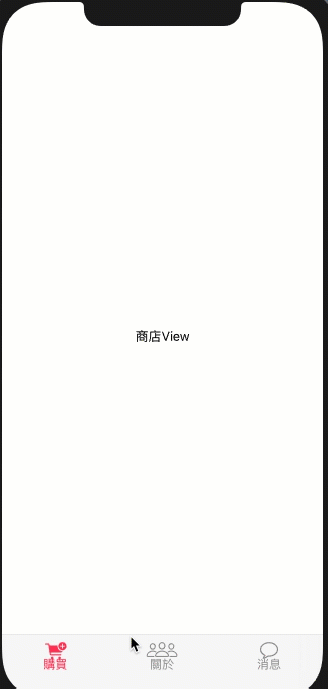
*** 自訂底下的主控 tab bar
**** Change tabView font size
#+begin_src swift -r -n :results output :exports nil
init() {
    UITabBarItem.appearance().setTitleTextAttributes([.font: UIFont.systemFont(ofSize: 14) ], for: .normal)
}

#+end_src
**** the color of unselected tab bar
#+begin_src swift -r -n :results output :exports nil
init() {
    UITabBar.appearance().unselectedItemTintColor = UIColor.systemGray3
}
#+end_src
**** the color of the tab bar item : .accentColor
#+begin_src swift -r -n :results output :exports nil
TabView {

}.accentColor(.pink)
#+end_src
**** the tab bar’s color: appearance()
兩種做法(尚未區分 backgroundColor 與 barTintColor 之差異)
***** init()
#+begin_src swift -r -n :results output :exports nil
init() {
        UITabBar.appearance().barTintColor = UIColor.systemPink
    }
#+end_src
***** onAppear()
與 init()共用時，onAppear()優先
#+begin_src swift -r -n :results output :exports nil
.onAppear() {
    UITabBar.appearance().barTintColor = .white
}
#+end_src
*** 以程式控制 tabbed view 的 subview 的切換
Users can tap the tab bar items to switch between tabs, which is automatically handled the TabView. In some use cases, you may want to switch to a specific tab programmatically. The TabView has another init method for this purpose. The method takes a state variable which associates with the tag value of the tabs.[fn:14]
#+begin_src swift -r -n :results output :exports nil
TabView(selection: $selection)
#+end_src
As an example, declare the following state variable in ContentView:
#+begin_src swift -r -n :results output :exports nil
@State private var selection = 0
#+end_src
Here we initialize the selection variable with a value of 0, which is the tag value of the first tab item. We haven’t defined the tag value for the tab items yet. Therefore, update the code like this and attach the tag modifier for each of the tab items:
#+begin_src swift -r -n :results output :exports nil
import SwiftUI

struct BookDetailView: View {
    var body: some View {
        Text("This is the Book Detail View")
    }
}

struct BookOrderView: View {
    var body: some View {
        Text("購物車")
    }
}

struct BookAboutView: View {
    var body: some View {
        Text("About me")
    }
}

struct ContentView: View {
    init() {
        UITabBar.appearance().barTintColor = UIColor.systemPink
        UITabBar.appearance().unselectedItemTintColor = UIColor.systemGray3
    }
    @State private var selection = 0
    var body: some View {

        ZStack(alignment: Alignment(horizontal: .trailing, vertical: .top), content: {
            TabView(selection: $selection,
                    content:  {
                        BookDetailView().tabItem {
                            Image(systemName: "book.fill")
                            Text("Detail")
                        }.tag(0)
                        BookOrderView().tabItem {
                            Image(systemName: "cart.fill")
                            Text("Order")
                        }.tag(1)
                        BookAboutView().tabItem {
                            Image(systemName: "person")
                            Text("About")
                        }.tag(2)
                    })
                .accentColor(.white)
            Button(action: {
                selection = (selection + 1) % 3
                print(selection)
            }, label: {
                Text("Button")
                    .padding(3)
                    .background(Color.pink)
                    .foregroundColor(.white)
                    .padding(3)
            })
        })
    }
}
#+end_src
*** 一個優秀的 Tab Bar 應該具備哪些特點？[fn:13]
1. 不會有太多的 tab
   每增加一個 tab 會減小了選擇各別的可觸區域，並增加 app 的複雜性，讓用戶更難找到所需的資料。即使“更多(More)”標籤可以展示額外的 tab，但這會需要額外的點擊步驟，而且沒有很好利用 tab bar 的有限空間。太少的 tab 也是問題，它會使你的界面感覺被分離。一般來說，在 iPhone 上應使用 3 至 5 個標籤，在 iPad 上則可稍微多幾個。
1. 不會經常變動
   在某個 tab 的功能無法使用時， 不要移除這個 tab 或是讓它失效。如果 tab 時有時無，App 界面會變得不穩定和難以捉摸。確保所有的 tab 都可有效點擊，並且向用戶解釋目前 tab 內容不可用的原因。譬如說，當 iOS 裝置沒有歌曲時，音樂 app 的“我的音樂”tab 會顯示如何下載歌曲的說明。
1. 應在相連接的視窗進行內容的轉換
   為了讓界面符合用戶預期，選擇一個 tab 後的作用應該直接顯示於與其 tab bar 相連的視窗，而不是螢幕上其它範圍的視窗。例如，如在左邊的 split view 選擇了一個 tab，是不會讓右半部分突然產生變化的。在 popover 中選擇的 tab 不會導致後方的視窗發生改變。
1. 應保持 icon 的風格統一和平衡
   系統提供了一系列預先設定好、一般用途的 icon，我們也可以創建自己的 icon，確保 tab bar icon 在視覺上的風格統一和平衡。
1. 應使用 badge 傳遞信息
   我們可以在 tab 上加上 badge (一個紅色橢圓上帶有白色數字或感嘆號的圖案) ，來暗示該 tab 或模式有新信息。
*** Further Reading
- [[https://www.appcoda.com/swiftui-tabview/][Customizing the Tab Bar Color]]
- [[https://www.youtube.com/watch?v=tDyvkIe9RsA][Tabbed View SwiaftUI - TabBar Tutorial & Basic Customization - Xcode 11 - 2019]]
- [[https://medium.com/@nwyyy/swift%E7%AD%86%E8%A8%98-tab-bar-2ddba7d56587][iOS筆記：Tab Bar]]
- [[https://www.simpleswiftguide.com/][Simple Swift Guide]]
#+latex:\newpage

** Navigation Views
:PROPERTIES:
:CUSTOM_ID: navigation
:END:
*** Navigation bar
- 於 body 中最外層的 component 之外加入 NavigationView
- Title: navigationBarTitle()，title 置於 NavigationView {}內 attach 在 List 上，因為 NavigationView 主要負責於不同的 View 中切換，每個 View 都會有自己的 content 與 Title。
- DisplayMode 有 三類：
  1) large: 適用於 top level
  2) inline: 適用於 detail level
  3) automatic: 自動判斷有無 parent level
#+begin_src swift -r -n :eval no
import SwiftUI
  ...

struct ContentView: View {
    ....
    var body: some View {
        NavigationView {
            List(books) { book in
                ...
                }
            .navigationBarTitle(Text("書單"))
            .navigationBarTitleDisplayMode(.large)
            }
        }
    }
}
...
#+end_src
#+CAPTION: Navigation bar
#+LABEL:fig:Navigation-1
#+name: fig:Navigation-1
#+ATTR_LATEX: :width 300
#+ATTR_ORG: :width 300
#+ATTR_HTML: :width 300
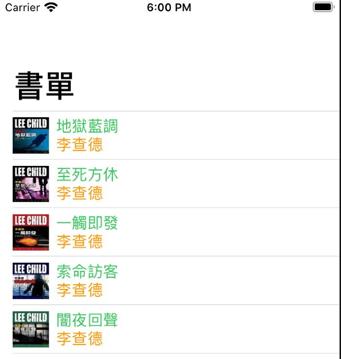

**** Hide Navigation Bar
使用 Hide 與不設定 BarTitle 的差異在於：後者仍會佔掉 Bar 的空間
#+begin_src swift -r -n :results output :exports nil
import SwiftUI
  ...

struct ContentView: View {
    ....
    var body: some View {
        NavigationView {
            List(books) { book in
                ...
                }
            .navigationBarTitle(Text("書單"))
            .navigationBarTitleDisplayMode(.large)
            .navigationBarHidden(true)
            }
        }
    }
}
...
#+end_src

***** NavigationLink
****** Create
****** 語法:
#+begin_src swift -r -n :results output :exports both
NavigationLink(<title: StringProtocol, destination:)
#+end_src
****** 方式
1. Attach link in NavigationLink()
 #+begin_src swift -r -n :results output :exports nil
struct ContentView: View {
    var body: some View {
        NavigationView {
            VStack {
                NavigationLink("JumpToSecond", destination: SecondView())
                Text("Hello, world!")
                    .padding()
            }
            .navigationTitle("Book List")
            .navigationBarTitleDisplayMode(.large)
        }
    }
}
#+end_src
2. Attach link to other object(Text in this example)
#+begin_src swift -r -n :results output :exports nil
struct ContentView: View {
    var body: some View {
        NavigationView {
            VStack {
                NavigationLink(destination: SecondView()) {
                    Text("TextLink")
                        .padding()
                }
            }
            .navigationTitle("Book List")
            .navigationBarTitleDisplayMode(.large)
        }
    }
}
#+end_src
若是將 link attach 至 image，則要加上 renderingMode，否則會看不到圖，例：
#+begin_src swift -r -n :results output :exports nil
struct ContentView: View {
    var body: some View {
        NavigationView {
            VStack {
                NavigationLink(destination: SecondView()) {
                    Image(systemName: "myImage")
                        .renderingMode(.original)
                }
            }
            .navigationTitle("Book List")
        }
    }
}
#+end_src

***** Reading
- [[https://www.youtube.com/watch?v=nA6Jo6YnL9g][The Complete Guide to NavigationView in SwiftUI]]
*** Create New Views
**** in same file
#+begin_src swift -r -n :results output :exports nil
import SwiftUI

struct BookDetailView: View {
    var body: some View {
        Text("This is the Book Detail View")
    }
}

struct ContentView: View {
    var body: some View {
        NavigationView {
            VStack {
                NavigationLink(destination: BookDetailView()) {
                    Text("GoToDetail")
                }
            }
              .navigationTitle("Book List")

        }
    }
}
#+end_src
***** class exercise
為上述 NavigationView 加入另外兩個 subView: OrderView, AboutView
**** in new file
將上述專案中的每個 subView 改為獨立 View
*** Passing parameter(單純參數傳遞)
Single way, Just pass variable from A to B.
#+begin_src swift -r -n :results output :exports nil
struct BookDetailView: View {
    var operation: String
    var body: some View {
        Text("已為你\(operation)這本書")
    }
}

struct ContentView: View {
    var body: some View {
        NavigationView {
            VStack {
                NavigationLink(destination: BookDetailView(operation: "借閱")) { Text("Loan")
                }
                NavigationLink(destination: BookDetailView(operation: "續借")) { Text("Renew")
                }
                NavigationLink(destination: BookDetailView(operation: "歸還")) { Text("Return")
                }
            }
              .navigationTitle("Book List")

        }
    }
}
#+end_src
*** Version-1: Navigation v.s. List v.s. NavigationLink
#+begin_src swift -r -n :eval no
//
//  ContentView.swift
//  navigation
//
//  Created by yen yung chin on 2020/9/27.
//

import SwiftUI

struct Book: Identifiable {
    var id = UUID()
    var title: String
    var author: String
}

struct ContentView: View {
    var books = [
        Book(title:"X的悲劇", author: "艾勒里．昆恩"),
        Book(title:"地獄藍調", author: "李查德"),
        Book(title:"東方列車謀殺案", author: "阿嘉莎‧克莉絲蒂"),
        Book(title:"八百萬種死法", author: "勞倫斯.卜洛克"),
        Book(title:"血字研究", author: "柯南道爾")
    ]

    var body: some View {
        NavigationView {
            List(books) { book in
                NavigationLink(destination: DetailView(book: book) ){
                        bookRow(book: book)
                    }
                }
            .navigationTitle("書單")
        }
    }
}

struct bookRow: View {
    var book: Book
    var body: some View {
        VStack {
            Text(book.title)
            Text(book.author)
        }
    }
}

struct DetailView: View {
    var book: Book
    var body: some View {
        VStack {
            Text(book.title)
        }
    }
}

struct ContentView_Previews: PreviewProvider {
    static var previews: some View {
        ContentView()
    }
}

#+end_src
*** Version-2:
將記錄架構(Book.swift)、List(ContentView.swift)以及 Detail(DetailView.swift)各自以獨立檔案設計。
**** Book.swift
#+begin_src swift -r -n :eval no
// 不涉及使用者界面

import Foundation

// 建立一個書籍的基本結構
// 加上Identifiable以及UUID()是為了可以將書籍透過List來呈現

struct Book: Identifiable {
    var id = UUID() //產生一個唯一(unique)的亂數
    var title: String
    var author: String
    var image: String
}
#+end_src
**** ContentView.swift
#+begin_src swift -r -n :eval no
import SwiftUI

struct ContentView: View {
    // 在這裡臨生產生一個Book陣列，然後在List秀出來
    var books = [
        Book(id: UUID(), title: "地獄藍調", author: "李查德", image: "b1"),
        Book(id: UUID(), title: "至死方休", author: "李查德", image: "b2"),
        Book(id: UUID(), title: "一觸即發", author: "李查德", image: "b3"),
        Book(id: UUID(), title: "索命訪客", author: "李查德", image: "b4")
    ]

    var body: some View {
        NavigationView {
            List(books) { book in
                NavigationLink(destination: DetailView(thisbook: book)) {
                    VStack(alignment: .leading) {
                        Text(book.title)
                            .font(.title)
                        Text(book.author)
                            .font(.subheadline)
                    }
                .navigationBarTitle("我的書單")
                }
            }
        }
    }
}

struct ContentView_Previews: PreviewProvider {
    static var previews: some View {
        ContentView()
    }
}
#+end_src
#+CAPTION: 主選單
#+LABEL:fig:Navi-List-1
#+name: fig:Navi-List-1
#+ATTR_LATEX: :width 300
#+ATTR_ORG: :width 300
#+ATTR_HTML: :width 300
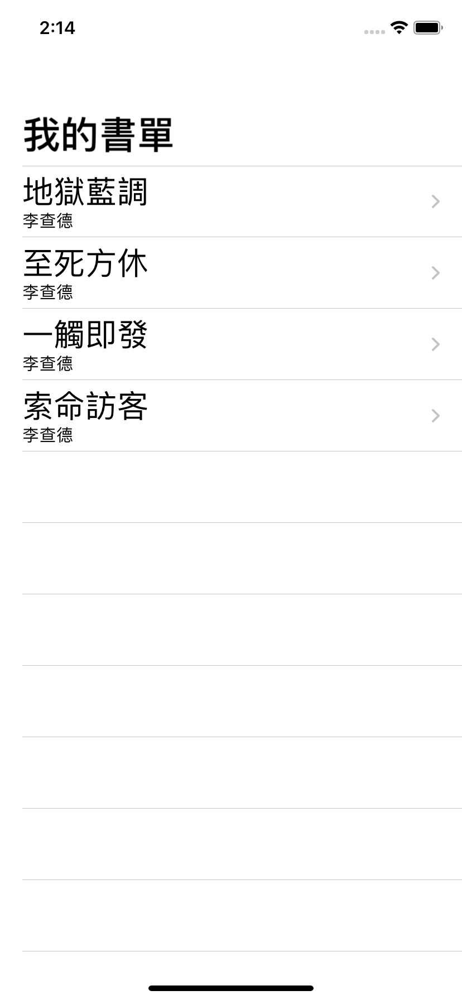
**** DetailView.swift
#+begin_src swift -r -n :eval no
import SwiftUI

struct DetailView: View {
    //我希望等一下有任何人呼叫我，一定要傳書本的資料給我
    var thisbook: Book
    var body: some View {
        VStack {
            Image(thisbook.image)
            Text(thisbook.title)
            Text(thisbook.author)
        }

    }
}

struct DetailView_Previews: PreviewProvider {
    static var previews: some View {
        // 臨時給個資料，讓preview可以秀出來就好

        DetailView(thisbook: Book(id: UUID(), title: "索命訪客", author: "李查德", image: "b4"))
    }
}
#+end_src
#+CAPTION: Detail
#+LABEL:fig:Navi-List-2
#+name: fig:Navi-List-
#+ATTR_LATEX: :width 300
#+ATTR_ORG: :width 300
#+ATTR_HTML: :width 300
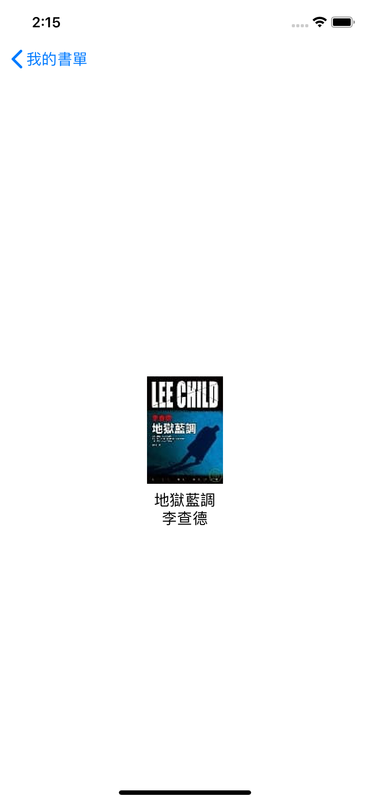

#+latex:\newpage

* Dynamic List
:PROPERTIES:
:CUSTOM_ID: DynamicList
:END:
** DataModel
每筆記錄的基本欄位
*** BookModel.swift (Model)
#+begin_src swift -r -n :results output :exports nil
import Foundation

struct BookModel: Identifiable {
    var id = UUID()
    var title: String
    var author: String
}

#+end_src
** ViewModel
*** Book.swift
資料來源:所有書本的內容，建立一個 ObservableObject 的 class，以@Published 方式分享書籍記錄(list)
#+begin_src swift -r -n :results output :exports nil
import Foundation

class Book: ObservableObject{
    @Published var list: [BookModel]
    init(){
        self.list = [
            BookModel(title:"X的悲劇", author: "艾勒里．昆恩"),
            BookModel(title:"地獄藍調", author: "李查德"),
            BookModel(title:"東方列車謀殺案", author: "阿嘉莎‧克莉絲蒂"),
            BookModel(title:"八百萬種死法", author: "勞倫斯.卜洛克"),
            BookModel(title:"血字研究", author: "柯南道爾")
        ]
    }
}
#+end_src
** 主畫面
*** ContentView.swift
以@ObservedObject 的方式讀取 ViewModel 裡分享的記錄
#+begin_src swift -r -n :results output :exports nil
import SwiftUI

struct ContentView: View {
    @ObservedObject var book = Book()
    @State var showNewBook = false
    var body: some View {
        NavigationView {
            List(book.list) { book in
                NavigationLink(destination: Text("Show Detail here...") ){
                    bookRow(book: book)
                }
            }
            .navigationBarItems(trailing: Button("New"){
                self.showNewBook = true
            }.sheet(isPresented: self.$showNewBook, content: {
                AddNewBook(book: book, showThisView: $showNewBook, title: "", author: "")
            }))
        }
    }
}

struct bookRow: View {
    var book: BookModel
    var body: some View {
        VStack(alignment: .leading) {
            Text(book.title)
            Text(book.author)
        }
    }
}

struct ContentView_Previews: PreviewProvider {
    static var previews: some View {
        ContentView()
    }
}

#+end_src
** 加入新記錄
*** AddNewBook.swift
以@ObservedObject 的方式新增 ViewModel 裡分享的記錄
#+begin_src swift -r -n :results output :exports nil
import SwiftUI
import Combine

struct AddNewBook: View {
    @ObservedObject var book = Book()
    @Binding var showThisView: Bool
    @State  var title: String
    @State  var author: String

    var body: some View {
        VStack {
            Text("Adding New Book....")
            TextField("書名", text: self.$title)
            TextField("作者", text: self.$author)
            Button("Done") {
                book.list.append(BookModel(title: self.title, author: self.author))
                showThisView.toggle()
            }
        }
        Text("TEST")
    }
}

struct AddNewBook_Previews: PreviewProvider {
    static var previews: some View {
        AddNewBook(showThisView: .constant(true), title: "", author: "")
    }
}

#+end_src
** 加入搜尋功能
為 List 加入基本的搜尋(過濾)功能十分容易，最簡單的方式就是在 List 上方加入一個 TextField，宣告一個@State 變數 Bind 到這個 TextField，然後以這個變數做為 List 的搜尋條件。接下來就在 list 後加入 filter，這裡用到的 filter 語法為:
#+begin_src swift -r -n :eval no
book.list.filter ({ self.filterKey.isEmpty ? true : $0.title.contains(self.filterKey.lowercased())})
#+end_src
裡面的 A ? B : C 意思是，如果條件 A 成立，就傳回 B，否則就傳回 C，即，如果 TextField 裡沒有搜尋值，則 filterKey.isEmpty 會成立，就不進行過濾(傳回 true)，否則就傳回那些書名包含 filterKey 的記錄($0.title.contains(self.filterKey.lowercased())，另，為避免大小寫問題，一律轉為小寫
#+begin_src swift -r -n :eval no
import SwiftUI

struct ContentView: View {
    //建立一個BookClass類別的物件，叫做book
    @ObservedObject var book = BookClass()
    @State var showNewbookView = false
    @State var filterKey = "" //儲存搜尋內容
    var body: some View {
        VStack {
            // 這裡輸入要搜尋的關鍵字
            TextField("請輸入搜尋內容", text: $filterKey)
            NavigationView {
                // 透過對list進行即時filter來過濾list的顯示結果
                // 如果filterKey沒有值，就將filter條件設為true(不過濾)
                List(book.list.filter ({ self.filterKey.isEmpty ? true : $0.title.contains(self.filterKey.lowercased())})) { book in
                    NavigationLink(destination: DetailView(thisbook: book)) {
                        VStack(alignment: .leading) { //cell格子
                            Text(book.title)
                                .font(.title)
                            Text(book.author)
                                .font(.subheadline)
                        }
                        .navigationBarTitle("我的書單")
                    }
                }

            }
        }
    }
}
struct ContentView_Previews: PreviewProvider {
    static var previews: some View {
        ContentView()
    }
}

#+end_src
#+CAPTION: 搜尋功能
#+LABEL:fig:searching
#+name: fig:searching
#+ATTR_LATEX: :width 300
#+ATTR_ORG: :width 300
#+ATTR_HTML: :width 300
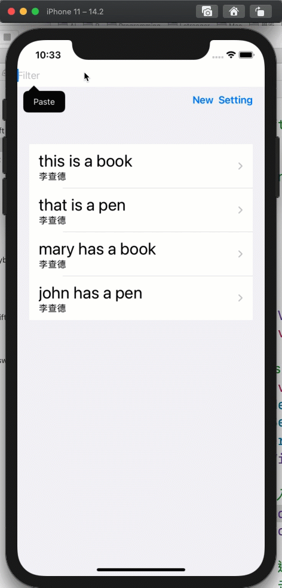

* Passing data between Views
** Passing data between Views #2: @ObservedObject
:PROPERTIES:
:CUSTOM_ID: ObservedObject
:END:
*** ObservedObject 範例
前節的 Book.swift 中使用@Published 將書籍資料設定為可以其他 View 共享，與@State, @Binding 相同，@Published 為一種 Property wrapper(屬性包裝器)。SwiftUI 中幾個常見的 @ 開頭修飾，如 @State，@Binding，@Environment，@EnvironmentObject 等都是運用了 Property Wrappers 這個特性。

當你以 @State 來標註一個屬性時，SwiftUI 會自動儲存它在你的應用程式的某處。還有，使用這些屬性的視圖會自動監聽屬性值的變更。在狀態改變時，SwiftUI 會重新計算那些視圖並更新應用程式的外觀。

@Published 可以讓我們建立 observable object(如前節 Book.swift 的 list)
#+begin_src swift -r -n :results output :exports nil
import Foundation

class Book: ObservableObject{
    @Published var list: [BookModel]
    init(){
        self.list = [
            BookModel(title:"X的悲劇", author: "艾勒里．昆恩"),
            BookModel(title:"地獄藍調", author: "李查德"),
            BookModel(title:"東方列車謀殺案", author: "阿嘉莎‧克莉絲蒂"),
            BookModel(title:"八百萬種死法", author: "勞倫斯.卜洛克"),
            BookModel(title:"血字研究", author: "柯南道爾")
        ]
    }
}
#+end_src
被宣告為@Published 變數，SwiftUI 會自動監控 list，一旦其內容有所變更，則所有引用到這個 object 的 View 都會接收到通知，然後重新載入做必要的變更。至此，我們只做好了資料來源端的設定，那麼，要使用這些共享變數的 View 要如何做呢？可以先看一下前節的 ContentView.swift 或 AddNewBook.swift：
#+begin_src swift -r -n :results output :exports nil
import SwiftUI

struct ContentView: View {
    @ObservedObject var book = Book()
    @State var showNewBook = false
    var body: some View {
        NavigationView {
            List(book.list) { book in
                NavigationLink(destination: Text("Show Detail here...") ){
                    bookRow(book: book)
                }
            }
            .navigationBarItems(trailing: Button("New"){
                self.showNewBook = true
            }.sheet(isPresented: self.$showNewBook, content: {
                AddNewBook(book: book, showThisView: $showNewBook, title: "", author: "")
            }))
        }
    }
}
///... 下略
#+end_src

不同於@State，在 ContentView 以及 AddNewBook.swift 中，我們以@ObservedObject 建立外部參考型態(external reference type)的變數(即之前以@Published 宣告的變數)，所有以@ObservedObject 包裝的變數都必須 conform @ObservableObject protocol(即 class Book)，透過此二者的連結，我們就能輕易的在不同的 View 間共享或編輯變數(如本例中的 book)
*** ObservedObject 特性
- Can be shared across views
- More complex properties (e.g custom type)
- External reference type that has to be managed (Create an instance of the class, create its own properties, ...)
- Class should confrom to *ObservableObject*
- *@Published* property wrapper used to mark properties that should force a view to refresh
- The wrappedValue is: anything that implements the OvservableObject protocol (ViewModels basicly).
- What is does: invalidates the View when wrappedValue does objectWillChange.send().
- Projected value (i.e. %): a Binding (to the vars of the wrappedValue (a ViewModel)). You can bind a variable in your View to the variable in your ViewModel with @ObservedObject.
- @ObservedObject 的用處和 @State 非常相似，從名字看來它是來修飾一個對象的，這個對象可以給多個獨立的 View 使用。如果你用 @ObservedObject 來修飾一個對象，那麼那個對象必須要實現 ObservableObject 協議，然後用 @Published 修飾對象裡屬性，表示這個屬性是需要被 SwiftUI 監聽的。[fn:7]
*** @ObservedObject v.s. @ObjectBinding
另一種與@ObservedObject 有點相似的 wrapper 為@ObjectBinding，但不同的是，使用@ObservedObject 的 object 必須要有@Published wrapper；而使用@ObjectBinding 則要自已加上 didChange。@ObjectBindin 的範例如下:
#+begin_src swift -r -n :results output :exports nil
import SwiftUI

class User:BindableObject {
   var didChange = PassthroughSubject<Void,Never>()
   var username = "Saravana" { didSet { didChange.send() } }
   var password = "iuwerosdkj3298" { didSet { didChange.send() } }
   var email = "saravkumar.g@gmail.com" { didSet { didChange.send() } }
}

struct ContentView:View {
	@ObjectBinding var user = User()

	var body: some View {
      VStack {
      	TextField($user.username)
      	TextField($user.password)
      	TextField($user.email)
      }
	}
}
#+end_src

** Passing data between Views #3: @EnvironmentObject
:PROPERTIES:
:CUSTOM_ID: EnvironmentObject
:END:
適用時機: SwiftUI’s @EnvironmentObject property wrapper allows us to create views that rely on shared data, often across an entire SwiftUI app. For example, if you create a user that will be shared across many parts of your app, you should use @EnvironmentObject[fn:15]. 其相關特性如下:
- Similar to @ObservedObject
- Possibility to make it available to all views through the application itself
- If one view changes the model all views update
*** @EnvironmentObject 與@ObservedObject 的異同
**** 相同
@EnvironmentObject has a lot in common with @ObservedObject
- both must refer to a class that conforms to ObservableObject
- both can be shared across many views,
- and both will update any views that are watching when significant changes happen.
**** 差異
- However, @EnvironmentObject specifically means “this object will be provided from some outside entity, rather than being created by the current view or specifically passed in.[fn:15]
**** 比較
| @State                                   | @ObservedObject                                                                                                  | @EnvironmentObject                                                           |
|------------------------------------------+------------------------------------------------------------------------------------------------------------------+------------------------------------------------------------------------------|
| Simple properties like *String* or *Int* | Can be shared across views                                                                                       | Similar to @ObservableObject                                                 |
| Belongs to a specific view               | More complex properties (e.g. custom type)                                                                       | Possibility to make it available to all views through the application itself |
| Never used outside that view             | External reference type that has to be managed (Create an instance of the class, create its own properties, ...) | If one view changes the model all views update                               |
|                                          | Class should conform to *ObservableObject*                                                                       |                                                                              |
|                                          | *Published* property wrapper used to make properties that should force a view to refresh                         |                                                                              |
**** 範例
以如下 app 為例，若 View A 裡有某些 data 要在未來與 View E 共用，若是使用@ObservedObject 來進行分享，則 View A 要依序將這些 data 傳給 View B、View C、View D，最後再傳到 View E 裡。
然而，若使用@EnvironmentObject 的機制來進行分享 data，則可以在 View A 中將這些要分享的 data 置於 Swift environment 中，所有處於同一 environment 中的所有 View 都能與之共享，而不用依次傳遞。
#+CAPTION: @Environment 適用狀況
#+LABEL:fig:EnvironmentObject
#+name: fig:EnvironmentObject
#+ATTR_LATEX: :width 500
#+ATTR_ORG: :width 500
#+ATTR_HTML: :width 500
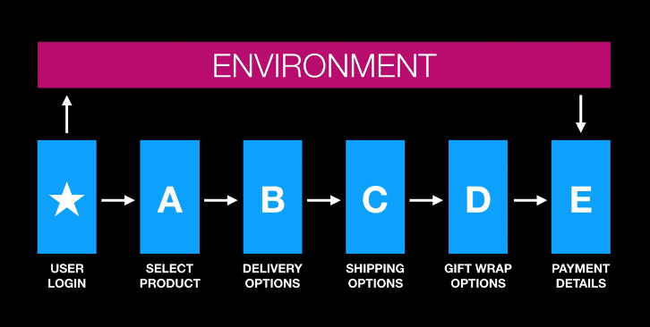
*** EnvironmentObject 設定方式
**** 建立 EnvironmentObject class
UserSettings.swift (ObservableObject)
#+begin_src swift -r -n :eval no
import SwiftUI

class UserSettings: ObservableObject {
    @Published var name = ""
    // use this ObservableObject as an environment object
}
#+end_src
**** 設定 app 環境
***** Xcode 11.X: SceneDeleate.swift
加入變數宣告(x)及 environmentObject(x)
#+begin_src swift -r -n :eval no
//....

var settings: UserSettings()
func scene(.......) {
    //....
    //let tabbedView = TabbedView()
    let contentView = ContentView()
}
//....
#+end_src
***** Xcode 12.X: xxxApp.swift
#+begin_src swift -r -n :results output :exports nil
import SwiftUI

@main
struct bindingApp: App {
    var settings: UserSettings()
    var body: some Scene {
        WindowGroup {
            ContentView().environmentObject(settings)
        }
    }
}
#+end_src
**** 設定 Client View
***** Read
UserSettingsView.swift
#+begin_src swift -r -n :eval no
import SwiftUI

struct UserSettingsView: View {
    @EnvironmentObject var settings: UserSettings
    var body: some View {
        VStack {
            Text("My anme: \(settings.name)")
            EditView()
        }
    }
}
#+end_src
***** Write
EditView.swift
#+begin_src swift -r -n :eval no
import SwiftUI

struct EditView: View {
    @EnvironmentObject var settings: UserSettings
    var body: some Veiw {
        TextField("Type in your name:", text: $settings.name)
    }
}
#+end_src
*** 範例
建立 environment 物件(ShoppingCart)，由各 View 共享/編輯內容
**** ShoppingCart.swift
情境說明：在 app 中建立一個 ShoppingCart 類別，並讓這個 class confirm ObservableObject protocol，於 class 中將要在各 View 中 share 的 property 以@Published 標示出來。
#+begin_src swift -r -n :results output :exports nil
import Foundation

class ShoppingCart: ObservableObject {
    @Published var Title = "item"
    @Published var items = 0
}
#+end_src
**** 環境設定 SceneDelegate.swift / xxxApp.swift
環境變數由 swift 環境提供，故在 SceneDelegate.swift 檔案中宣告要共享的變數(程式第[[(decEnvObj)]]行)，並於 UIHostingController function 中將之加入起始 View 中，如下列程式第[[(attEnvObj)]]行。
***** 舊版: SceneDelegate.swift
#+begin_src swift -r -n :results output :exports nil
import UIKit
import SwiftUI

class SceneDelegate: UIResponder, UIWindowSceneDelegate {

    var window: UIWindow?
    var cart = ShoppingCart() (ref:decEnvObj)

    func scene(_ scene: UIScene, willConnectTo session: UISceneSession, options connectionOptions: UIScene.ConnectionOptions) {

        let contentView = ContentView()

        // Use a UIHostingController as window root view controller.
        if let windowScene = scene as? UIWindowScene {
            let window = UIWindow(windowScene: windowScene)
            window.rootViewController = UIHostingController(rootView: contentView.environmentObject(cart)) (ref:attEnvObj)
            self.window = window
            window.makeKeyAndVisible()
        }
    }
    //....
}
#+end_src
***** 新版: xxxApp.swift
在 WWDC20 之前，使用 SwiftUI 建立 View 必須將其包裝在 UIHostingController，Controller 被包裝在一個 UIWindow，window 在 SceneDelegate 中定義。在 WWDC20 之後，一個新的解決方案出現：App。

在之前我們使用 AppDelegate 和 SceneDelegate 來管理生命週期，這樣很繁瑣。如今使用 App Name App.swift 文件來代替。
#+begin_src swift -r -n :results output :exports nil
import SwiftUI

@main
struct bindingApp: App {
    var cart = ShoppingCart()
    var body: some Scene {
        WindowGroup {
            ContentView().environmentObject(cart)
        }
    }
}
#+end_src
**** ContentView.swift
在每一個要使用到這個 EnvironmentObject 的 View 中以@EnvironmentObject 來建立該 class 的 instance(第[[(environmentObject)]]行)，同時，在 previews 中也要加入 environmentObject()的 modifier(第[[(emptyConstructor)]]行)，在需用到環境變數的 View(如 SecondView)被呼叫時加入 environmentObject(第[[(envObj)]]行)。

#+begin_src swift -r -n :results output :exports nil
import SwiftUI

struct ContentView: View {

    @State private var showCart: Bool = false
    @EnvironmentObject var cart: ShoppingCart (ref:environmentObject)

        var body: some View {
        VStack {
            Text(cart.Title)
            Spacer()
            Text("Item Name: \(self.cart.Title)")
            Text("目前數量\(self.cart.items)")
            Button("下單") {
                self.showCart = true
            }.sheet(isPresented: self.$showCart, content: {
                SecondView().environmentObject(self.cart) (ref:envObj)
            })
            Spacer()
        }
    }
}

struct ContentView_Previews: PreviewProvider {
    static var previews: some View {
        ContentView().environmentObject(ShoppingCart()) (ref:emptyConstructor)
    }
}
#+end_src
**** SecondView
同樣的，在 SecondView 中要使用到 environment object 也要以@EnvironmentObject 來宣告利用該 class 所建立的 instance(第[[(useEnv)]]行)，而 SecondView 的 preview 也要加上同樣的 modifier(傳入參數)。
#+begin_src swift -r -n :results output :exports nil
import SwiftUI

struct SecondView: View {
    @EnvironmentObject var cart: ShoppingCart (ref:useEnv)
    var body: some View {
        VStack {
            Text("\(self.cart.Title)")
            Spacer()
            TextField("Item Name", text: self.$cart.Title)
            Text("amount: \(self.cart.items)")
            Button("加購") {
                self.cart.items += 1
            }
            Spacer()
        }
    }
}

struct SecondView_Previews: PreviewProvider {
    static var previews: some View {
        SecondView().environmentObject(ShoppingCart())
    }
}
#+end_src
這裡的 cart.items 在變更後，ContentView 的數量會即時更新，同樣的，ContentView 中被變更的 Title 也會即時在 SecondView 中看出結果。

#+LATEX: \newpage
*** Further Reading
- [[https://www.youtube.com/watch?v=iH88uJcdzDM][SwiftUI Reactive Intro - Understanding State and Binding in SwiftUI in Xcode 11 (2019)]]
- [[https://medium.com/%E5%BD%BC%E5%BE%97%E6%BD%98%E7%9A%84-swift-ios-app-%E9%96%8B%E7%99%BC%E5%95%8F%E9%A1%8C%E8%A7%A3%E7%AD%94%E9%9B%86/%E7%94%A8%E7%8B%80%E6%85%8B%E8%A8%AD%E8%A8%88-swiftui-%E7%95%AB%E9%9D%A2-%E8%AA%8D%E8%AD%98-state-property-binding-27fea6885ead][用狀態設計 SwiftUI 畫面 — 認識 @State property，binding & Toggle]]
- [[https://www.youtube.com/watch?v=stSB04C4iS4][SwiftUI Tutorial: What's the difference between @State, @ObjectBinding, and @EnvironmentObject?]]
- [[https://youtu.be/cc23YTGZVbQ][iOS 13 SwiftUI Tutorial: Interactively Transition and Share Data between Views with SwiftUI]]
#+LATEX: \newpage

** Passing data between Views #4: Property Wrappers
:PROPERTIES:
:CUSTOM_ID: Wrappers
:END:
All of these @Something statements are property wrappers. A property wrapper is actually a struct. These structs encapsulate some "template" behavior applied to the vars they wrap.

The property wrapper feature adds *"syntactic sugar"* to make these structs easy to create/use." [fn:16]
*** SwiftUI 的狀態管理
[[https://onevcat.com/2020/06/stateobject/][資料來源:@StateObject 和 @ObservedObject 的区别和使用]]
在 2019 年 SwiftUI 剛問世時，除去專門用來管理手勢的@GestureState 以外，有三個常用的和狀態管理相關的 property wrapper，它們分別是@State，@ObservedObject 和@EnvironmentObject。根據職責和作用範圍不同，它們各自的適用場景也有區別[fn:17]。一般來說：
- @State 用於 View 中的私有狀態值，一般來說它所修飾的都應該是 struct 值，並且不應該被其他的 view 看到。它代表了 SwiftUI 中作用範圍最小，本身也最簡單的狀態，比如一個 Bool，一個 Int 或者一個 String。簡單說，如果一個狀態能夠被標記為 private 並且它是值類型，那麼@State 是適合的。
- 對於更複雜的一組狀態，我們可以將它組織在一個 class 中，並讓其實現 ObservableObject 協議。對於這樣的 class 類型，其中被標記為@Published 的屬性，將會在變更時自動發出事件，通知對它有依賴的 View 進行更新。View 中如果需要依賴這樣的 ObservableObject 對象，在聲明時則使用@ObservedObject 來訂閱。
- @EnvironmentObject 針對那些需要傳遞到深層次的子 View 中的 ObservableObject 對象，我們可以在父層級的 View 上用.environmentObject 修飾器來將它注入到環境中，這樣任意子 View 都可以通過@EnvironmentObject 來獲取對應的對象。

這基本就是初版 SwiftUI 狀態管理的全部了。看起來對於狀態管理，SwiftUI 的覆蓋已經很全面了，那為什麼要新加一個@StateObjectproperty wrapper 呢？
*** @StateObject v.s. @ObservedObject
@ObservedObject 不管存儲，會隨著 View 的創建被多次創建。而@StateObject 保證對像只會被創建一次。因此，如果是在 View 裡自行創建的 ObservableObjectmodel 對象，大概率來說使用@StateObject 會是更正確的選擇。@StateObject 基本上來說就是一個針對 class 的@State 升級版[fn:17]
**** 程式範例
#+begin_src swift -r -n :results output :exports nil
struct ContentView: View {
    @State private var showRealName = false
    var body: some View {
        VStack {
            Button("學號/姓名") {
                showRealName.toggle()
            }
            Text("學生: \(showRealName ? "202010101" : "王小明")")
            ScoreBoad().padding(.top, 10)
        }
    }
}

class ScoreModel: ObservableObject {
    init() {print("ScoreModel Created")}
    @Published var score: Int = 40
}

struct ScoreBoad: View {
    @ObservedObject var scoreModel = ScoreModel()
    @State private var pass = false

    var body: some View {
        VStack {
            Button("加10分") {
                scoreModel.score += 10
                if scoreModel.score >= 60 {
                    pass = true
                }
            }
            Text("分數: \(scoreModel.score)")
            Text("及格? \(pass ? "YES" : "NO")")
            GradeText(scoreModel: scoreModel).padding(.top, 10)
        }
    }
}

struct GradeText: View {
    @ObservedObject var scoreModel: ScoreModel

    var body: some View {
        if scoreModel.score >= 90 {
            return Text("等級:A")
        } else if scoreModel.score >= 80 {
            return Text("等級:B")
        } else {
            return Text("等級:QQ")
        }
    }
}
#+end_src
#+CAPTION: @ObservableObject v.s. @StateObject
#+NAME: fig: ObserveState
#+ATTR_LATEX: :width 300
#+ATTR_ORG: :width 300
#+ATTR_HTML: :width 300
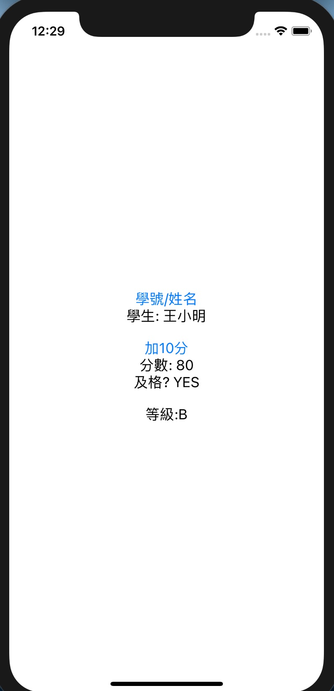

上例中，按加分後，及格與等級的判斷都能正常運作，然而一旦切換學生姓名與學號，scoreModel 的分數就會被重置為 60 分。原因在於按下「加分」button 導致 ContentView 的狀態發生變化，ContentView.body 被重新求值，連帶 scoreBoard 這個 View 也被重建，而其中的 scoreModel 也一起重新生成，於是之前所做的改變(狀態)就消失了。
**** Create once
只要理解了@ObservedObject 存在的問題，@StateObject 的意義也就很明顯了。@StateObject 就是@State 的升級版：@State 是針對 struct 狀態所創建的存儲，@StateObject 則是針對 ObservableObjectclass 的存儲。它保證這個 class 實例不會隨著 View 被重新創建。從而解決問題[fn:17]。

解決方案：把 scoreBoard 中的@ObservedObject 改為@StateObject
#+begin_src swift -r -n :results output :exports nil
...
struct ScoreBoad: View {
    @ObservedObject var scoreModel = ScoreModel()
    @State private var pass = false

    var body: some View {
        ....
    }
}
#+end_src
*** 使用@EnvironmentObject 保持狀態
除了@StateObject 外，另一種讓狀態 object 保持住的方式，是在更外層使用.environmentObject：
#+begin_src swift -r -n :results output :exports nil
struct SwiftUINewApp: App {
    var body: some Scene {
        WindowGroup {
            ContentView().environmentObject(scoreModel())
        }
    }
}
#+end_src
這樣，scoreModel 對象將被注入到環境中，不再隨著 ContentView 的刷新而變更。在使用時，只需要遵循普通的 environment 方式，把 Model 聲明為@EnvironmentObject 就行了：
#+begin_src swift -r -n :results output :exports nil
struct ScoreBoard: View {
    @EnvironmentObject var scoreModel: ScoreModel
    // ...

    // ScoreText(model: model).padding(.top, 20)
    ScoreText().padding(.top, 20)
}

struct GradeText: View {
    @EnvironmentObject var scoreModel: ScofeModel
    // ...
}
#+end_src
*** Property wrapper syntactic Sugar
#+begin_src swift -r -n :eval no
@Published var dice: Dice = Dice()
#+end_src
上述宣告實際同以下 struct
#+begin_src swift -r -n :eval no
struct Published {
    var wrappedValue: Dice
    var projectedValue: Publisher<Dice, Never>
}
#+end_src
接下來 Swift 產生以下變數
#+begin_src swift -r -n :eval no
var _dice: Published = Published(wrappedValue: Dice())
var dice: Dice {
    get { _dice.wrappedValue  }
    set { _dice.wrappedValue = newValue }
}
#+end_src
*** 各種 property wrapper 比較
Three ways for sharing data in SwiftUI[fn:18]
+------------------------------+------------------------------+------------------------------+
|@State                        |@ObservedObject               |@EnvironmentObject            |
+------------------------------+------------------------------+------------------------------+
|Simple properties like String |Can be shared across views    |Similar to @ObservedObject    |
|or Int                        |                              |                              |
+------------------------------+------------------------------+------------------------------+
|Belongs to a specific view    |More complex properties (e.g. |Possiblity to make it         |
|                              |custom type)                  |available to all views through|
|                              |                              |the application itself        |
+------------------------------+------------------------------+------------------------------+
|Never used outside that view  |External reference type that  |If one view changes the model |
|                              |has to be managed (Create an  |all views update              |
|                              |instance of the class, create |                              |
|                              |its own properties, ...)      |                              |
+------------------------------+------------------------------+------------------------------+
|                              |Class should conform to       |                              |
|                              |ObservableObject              |                              |
+------------------------------+------------------------------+------------------------------+
|                              |@Published property wrapper   |                              |
|                              |used to mark properties that  |                              |
|                              |should force a view to refresh|                              |
+------------------------------+------------------------------+------------------------------+
#+latex:\newpage

* UserDefaults
:PROPERTIES:
:CUSTOM_ID: UserDefaults
:END:
** 幾種可以在 iOS app 永久儲存資料的方式:
- Filesystem: FileManager
- SQL database: CoreData(自學)
- Cloud: ClodKit, Firebase(下學期進度)
- UserDefualts
** UserDefautls
我們可以將 UserDefaults 視為 persistent dictionary。UserDefaults 可以儲存 Property List 類型的資料。Property List is not a protocol or a struct or anything tangible or Swift-like. It is any combination of String, Int, Bool, Floating point, Date, Array or Dictionary.

A powerful way to do this is using the *Codable* protocol inf Swift. Codable converts structs into Data objects.
** Using userDefaults
#+begin_src swift -r -n :eval no
let defaults = UserDefaults.standard
#+end_src
*** Storing Data
#+begin_src swift -r -n :eval no
defaults.set(object, forKey: "SomeKey")
defautls.setDouble(37.5, forKey: "MyDouble")
#+end_src
*** Retrieving Data
#+begin_src swift -r -n :eval no
let i: Int = defaults.integer(forKey: "MyInt")
let u: URL? = defaults.url(forKey: "MyURL")
let strings: [String]? = defaults.stringArray(forKey: "MyString")
#+end_src
** Demo
*** Create UserDefault.swift
#+begin_src swift -r -n :results output :exports nil
import Foundation
import Combine

class UserSettings: ObservableObject {
    @Published var username: String {
        didSet {
            UserDefaults.standard.set(username, forKey: "username")
        }
    }
    @Published var isVIP: Bool {
        didSet {
            UserDefaults.standard.set(isVIP, forKey: "isAccountVIP")
        }
    }
    init() {
        self.username = UserDefaults.standard.object(forKey: "username") as? String ?? ""
        self.isVIP = UserDefaults.standard.object(forKey: "isAccountVIP") as? Bool ?? true
    }
}
#+end_src
*** use userSetting in ContentView.swift
#+begin_src swift -r -n :results output :exports nil
import SwiftUI

struct settingsView: View {
    @ObservedObject var userSettings = UserSettings()
    var body: some View {
        List {
            HStack {
                Text("Username")
                TextField("Username", text:$userSettings.username)
                    .textFieldStyle(RoundedBorderTextFieldStyle())
            }
            Toggle(isOn: $userSettings.isVIP) {
                Text("VIP Account")
            }.padding()
        }
    }
}

struct ContentView: View {
    var body: some View {
        NavigationView {
            VStack {
                Text("BALABALA")
                NavigationLink("Settings", destination: settingsView())
                Spacer()
            }.navigationTitle("主畫面")
            .padding()
        }
    }
}
#+end_src
#+CAPTION: UserDefault for Settings
#+LABEL:fig:UserDefaults
#+name: fig:UserDefaults
#+ATTR_LATEX: :width 500
#+ATTR_ORG: :width 500
#+ATTR_HTML: :width 500
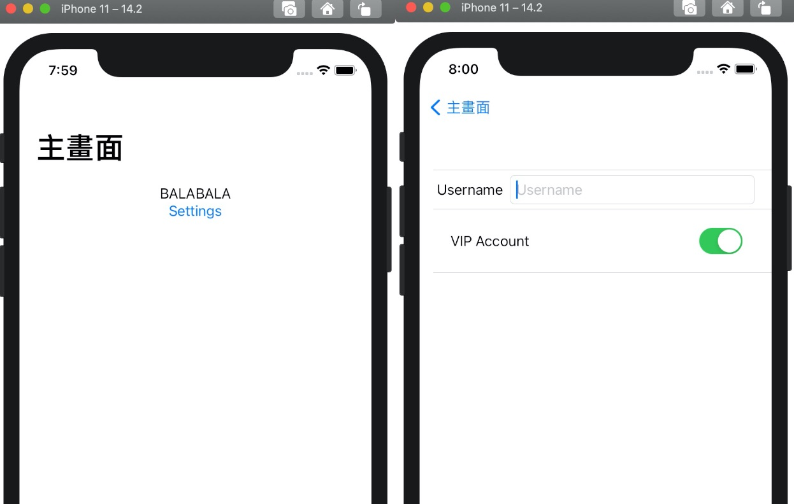
*** BookList: UserDefault v.s. @EnvironmentObject
**** UserSettings.swift
#+begin_src swift -r -n :results output :exports nil
//
//  UserSettings.swift
//  navigation
//
//  Created by yen yung chin on 2020/12/14.
//

import Foundation
import Combine

class UserSettings: ObservableObject {
    @Published var username: String {
        didSet {
            UserDefaults.standard.set(username, forKey: "username")
        }
    }
    @Published var isVIP: Bool {
        didSet {
            UserDefaults.standard.set(isVIP, forKey: "isAccountVIP")
        }
    }
    init() {
        self.username = UserDefaults.standard.object(forKey: "username") as? String ?? ""
        self.isVIP = UserDefaults.standard.object(forKey: "isAccountVIP") as? Bool ?? true
    }
}

#+end_src
**** ContentView.swift
The way to arrange ore than one navigationBarItems.
#+begin_src swift -r -n :results output :exports nil
//
//  ContentView.swift
//  navigation
//
//  Created by yen yung chin on 2020/9/27.
//

import SwiftUI

struct ContentView: View {
    @ObservedObject var book = Book()
    @State var showNewBook = false
    @State var showSetting = false
    @EnvironmentObject var userSettings: UserSettings
    var body: some View {
        NavigationView {
            List(book.list) { book in
                NavigationLink(destination: DetailView(book: book) ){
                    bookRow(book: book)
                }
            }
            .navigationTitle("\(userSettings.username)書單")
            .navigationBarItems(trailing:
                                    HStack {
                                        Button(action: { self.showNewBook = true }, label: {
                                            Image(systemName: "plus")
                                        }).sheet(isPresented: self.$showNewBook, content: {
                                            AddNewBook(book: book, showThisView: $showNewBook, title: "", author: "")
                                        })
                                        Button(action: {
                                                self.showSetting = true }, label: {
                                                    Image(systemName: "gearshape")
                                                }).sheet(isPresented: self.$showSetting, content: {
                                                    settingView(showThisView: self.$showSetting)
                                                })
                                    })
        }
    }
}

struct bookRow: View {
    var book: BookModel
    var body: some View {
        VStack(alignment: .leading) {
            Text(book.title)
            Text(book.author)
        }
    }
}

struct ContentView_Previews: PreviewProvider {
    static var previews: some View {
        ContentView()
    }
}

#+end_src
#+CAPTION: UserDefault v.s. @Environment
#+NAME: fig: DefaultEnvironment-1
#+ATTR_LATEX: :width 300
#+ATTR_ORG: :width 300
#+ATTR_HTML: :width 300
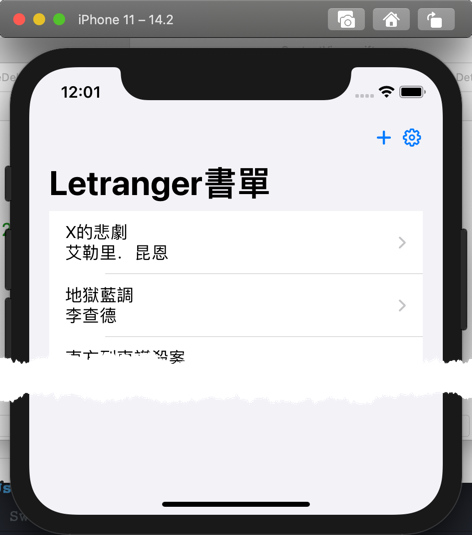
**** settingView.swift
#+begin_src swift -r -n :results output :exports nil
//
//  Setting.swift
//  navigation
//
//  Created by yen yung chin on 2020/12/14.
//

import SwiftUI

struct settingView: View {
    @EnvironmentObject var userSettings: UserSettings
    @Binding var showThisView: Bool
    var body: some View {
        VStack {
            Text("Setting").font(.largeTitle)
            Spacer()
            List{
                TextField("Username", text: $userSettings.username)
                Toggle(isOn: $userSettings.isVIP, label: {
                    Text("VIP")
                })
            }
            Button("DONE", action: {
                self.showThisView = false
            })
        }
    }
}

struct Setting_Previews: PreviewProvider {
    static var previews: some View {
        settingView(showThisView: .constant(true))
    }
}

#+end_src
#+CAPTION: UserDefault v.s. @Environment
#+NAME: fig: DefaultEnvironment-2
#+ATTR_LATEX: :width 300
#+ATTR_ORG: :width 300
#+ATTR_HTML: :width 300
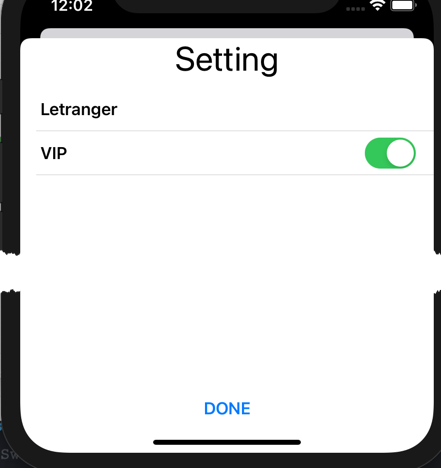
**** SceneDelegate.swift
#+begin_src swift -r -n :results output :exports nil

import UIKit
import SwiftUI

class SceneDelegate: UIResponder, UIWindowSceneDelegate {

    var window: UIWindow?
    var userSetting = UserSettings()

    func scene(_ scene: UIScene, willConnectTo session: UISceneSession, options connectionOptions: UIScene.ConnectionOptions) {

        let contentView = ContentView().environmentObject(userSetting)

        // Use a UIHostingController as window root view controller.
        if let windowScene = scene as? UIWindowScene {
            let window = UIWindow(windowScene: windowScene)
            window.rootViewController = UIHostingController(rootView: contentView)
            self.window = window
            window.makeKeyAndVisible()
        }
    }
      ......
}

#+end_src
** Reading Resources
- [[https://www.simpleswiftguide.com/how-to-use-userdefaults-in-swiftui/][How to use UserDefaults in SwiftUI]]

#+latex:\newpage

* Filtered List
為 Dynamic List 加入顯示過濾功能
** Model
BookModel.swift
#+begin_src swift -r -n :results output :exports nil
import Foundation

struct BookModel: Identifiable {
    var id = UUID()
    var title: String
    var author: String
    var liked: Bool
}

#+end_src
** ViewModel
Book.swift
#+begin_src swift -r -n :results output :exports nil
import Foundation

class Book: ObservableObject{
    @Published var list: [BookModel]
    init(){
        self.list = [
            BookModel(title:"X的悲劇", author: "艾勒里．昆恩", liked: false),
            BookModel(title:"地獄藍調", author: "李查德", liked: false),
            BookModel(title:"東方列車謀殺案", author: "阿嘉莎‧克莉絲蒂", liked: true),
            BookModel(title:"八百萬種死法", author: "勞倫斯.卜洛克", liked: false),
            BookModel(title:"血字研究", author: "柯南道爾", liked: true)
        ]
    }
}
#+end_src
** 主畫面
ContentView.swift
於 List 左上角加入一個 Hide/Show 的 Button，以控制是否於書籍列表中加入 Like
#+begin_src swift -r -n :results output :exports nil
import SwiftUI

struct ContentView: View {
    @ObservedObject var book = Book()
    @State var showNewBook = false
    @State var showLiked = true
    var body: some View {
        NavigationView {
            List(book.list) { book in
                NavigationLink(destination: Text("Show Detail here...") ){
                    bookRow(book: book, showLiked: self.showLiked)
                }
            }
            .navigationBarItems(
                leading: Button(
                    action: { self.showLiked.toggle() },
                    label: { Text(self.showLiked ? "Hide" : "Show") }
                ),
                trailing: Button("New"){
                    self.showNewBook = true
                }.sheet(isPresented: self.$showNewBook, content: {
                    AddNewBook(book: book, showThisView: $showNewBook, title: "", author: "", liked: false)
                }))
        }
    }
}

struct bookRow: View {
    var book: BookModel
    var showLiked: Bool
    var body: some View {
        VStack(alignment: .leading) {

            HStack {
                Text(book.title)
                if self.showLiked && book.liked{
                    Image(systemName: "heart").foregroundColor(.red)
                }
            }
            Text(book.author)
        }
    }
}

struct ContentView_Previews: PreviewProvider {
    static var previews: some View {
        ContentView()
    }
}
#+end_src
#+CAPTION: Filtered List
#+NAME: fig: FilteredList
#+ATTR_LATEX: :width 300
#+ATTR_ORG: :width 300
#+ATTR_HTML: :width 300
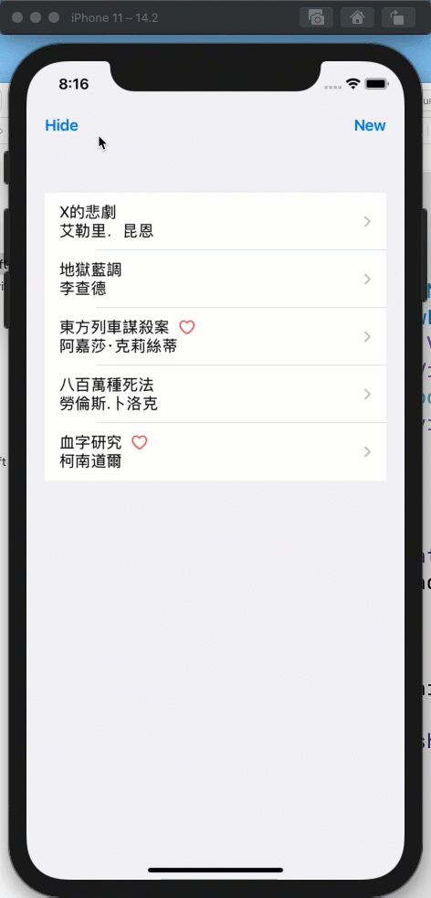

* Footnotes

[fn:1] [[https://medium.com/@mikru168/swiftui-%E6%B7%BA%E7%8E%A9-swiftui-%E7%94%A8%E5%85%B6%E5%BB%BA%E6%A7%8B%E4%B8%80%E7%B0%A1%E5%96%AE%E7%9A%84-app-2f2477bd49d7][簡介 SwiftUI & 用其建構一簡單的 APP ]]

[fn:2] [[https://medium.com/@SteelKiwiDev/swiftui-vs-uikit-benefits-and-drawbacks-6a540cced684][SwiftUI vs UIKit: Benefits and Drawbacks]]

[fn:3] [[https://www.appcoda.com.tw/swiftui-introduction/][SwiftUI 初體驗： 建構一個簡單 App　讓你了解 SwiftUI 有多強大！]]

[fn:4] [[https://medium.com/better-programming/say-goodbye-to-scenedelegate-in-swiftui-444173b23015][Say Goodbye to SceneDelegate in SwiftUI]]

[fn:5] [[https://stackoverflow.com/questions/56514998/find-all-available-images-for-imagesystemname-in-swiftui][Find all available images for Image(systemName:) in SwiftUI]]

[fn:6] [[https://medium.com/%E5%BD%BC%E5%BE%97%E6%BD%98%E7%9A%84-swift-ios-app-%E9%96%8B%E7%99%BC%E5%95%8F%E9%A1%8C%E8%A7%A3%E7%AD%94%E9%9B%86/%E7%94%A8%E7%8B%80%E6%85%8B%E8%A8%AD%E8%A8%88-swiftui-%E7%95%AB%E9%9D%A2-%E8%AA%8D%E8%AD%98-state-property-binding-27fea6885ead][用狀態設計 SwiftUI 畫面 — 認識 @State property，binding & Toggle]]

[fn:7] [[https://juejin.cn/post/6844903924084768776][[譯]理解 SwiftUI 裡的屬性裝飾器]]

[fn:8] [[https://medium.com/%E5%BD%BC%E5%BE%97%E6%BD%98%E7%9A%84-swift-ios-app-%E9%96%8B%E7%99%BC%E5%95%8F%E9%A1%8C%E8%A7%A3%E7%AD%94%E9%9B%86/%E5%AE%A2%E8%A3%BD-ui-%E5%85%83%E4%BB%B6%E6%A8%A3%E5%BC%8F%E7%9A%84-swiftui-modifier-b31ff65c1f0d][客製 UI 元件樣式的 SwiftUI modifier]]

[fn:9] [[https://medium.com/%E5%BD%BC%E5%BE%97%E6%BD%98%E7%9A%84-swift-ios-app-%E9%96%8B%E7%99%BC%E5%95%8F%E9%A1%8C%E8%A7%A3%E7%AD%94%E9%9B%86/swiftui-%E8%A3%81%E5%88%87%E5%BD%A2%E7%8B%80%E7%9A%84-clipshape-mask-4fc49b34141][SwiftUI 裁切形狀的 clipShape & mask]]

[fn:10] [[https://www.appcoda.com.tw/swiftui-border/][SwiftUI 小技巧：利用 border 修飾符　輕鬆為按鈕或文本繪製邊框]]

[fn:11] [[https://www.hackingwithswift.com/quick-start/swiftui/how-to-create-a-list-of-dynamic-items][How to create a list of dynamic items]]

[fn:12] [[https://www.hackingwithswift.com/quick-start/swiftui/what-is-the-binding-property-wrapper][What is the @Binding property wrapper?]]

[fn:13] [[https://medium.com/@nwyyy/swift%E7%AD%86%E8%A8%98-tab-bar-2ddba7d56587][iOS筆記：Tab Bar]]

[fn:14] [[https://www.appcoda.com/swiftui-tabview/][Introducing SwiftUI TabView and Working with Tab Bar Customization]]

[fn:15] [[https://www.hackingwithswift.com/quick-start/swiftui/what-is-the-environmentobject-property-wrapper][What is the @EnvironmentObject property wrapper?]]

[fn:16] [[https://www.youtube.com/watch?v=0i152oA3T3s][Lecture 9: Data Flow]]

[fn:17] [[https://onevcat.com/2020/06/stateobject/][@StateObject 和 @ObservedObject 的区别和使用]]

[fn:18] [[https://www.youtube.com/watch?v=cc23YTGZVbQ][iOS 13 SwiftUI Tutorial: Interactively Transition and Share Data between Views with SwiftUI]]

